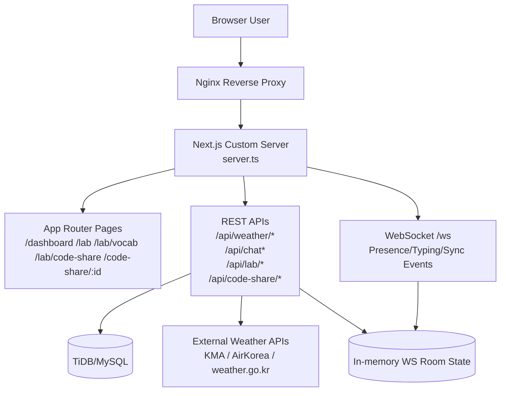
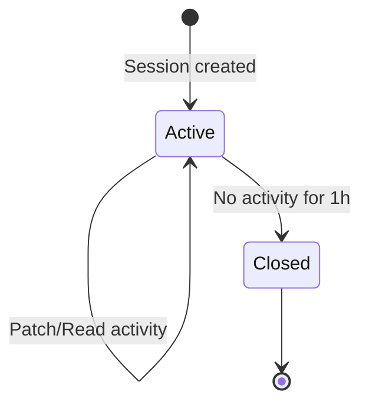
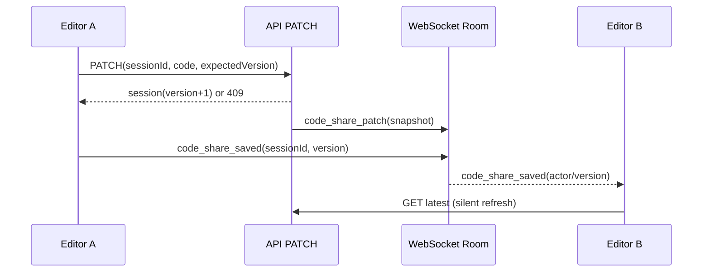

# Nadeulhae Integrated Guide (통합 완전판)

Nadeulhae는 **날씨·대기 데이터 기반 야외 판단 서비스 + 대시보드 채팅 + 실험실 기능(단어암기/코드공유)**를 하나로 통합한 Next.js 애플리케이션입니다.

이 문서는 현재 코드베이스 기준으로 **개발/배포/운영/트러블슈팅/테스트**를 한 번에 관리하는 기준 문서입니다.

## 1. Repository Layout

- App root: [`/Users/gimhyeonmin/test/Nadeulhae/nadeulhae`](/Users/gimhyeonmin/test/Nadeulhae/nadeulhae)
- This root README: [`/Users/gimhyeonmin/test/Nadeulhae/README.md`](/Users/gimhyeonmin/test/Nadeulhae/README.md)
- Deploy doc (auth + Ubuntu): [`/Users/gimhyeonmin/test/Nadeulhae/nadeulhae/docs/ubuntu-server-deploy-auth.md`](/Users/gimhyeonmin/test/Nadeulhae/nadeulhae/docs/ubuntu-server-deploy-auth.md)

## 2. High-Level Architecture



## 3. Major Modules

### 3.1 Weather Intelligence

- Current + forecast + image + archive + trend/insight API
- Location-aware scoring and safety/event summaries
- Weather/air quality cache + rate-limit strategy in API layer

### 3.2 Dashboard Chat

- Session-based conversation management
- Weather context attachment
- Session create/delete/select UX in dashboard panel
- JSON-only mutation handling (previous delete issue fixed)

### 3.3 Lab Hub

- `/lab`에서 실험 기능 진입
- 현재 실험 기능:
  - `/lab/vocab` (단어 암기)
  - `/lab/code-share` (코드공유 허브)

### 3.4 Code Share (실시간 협업)

- 허브: `/lab/code-share`
  - 새 세션 만들기(1개 CTA)
  - 이전 세션 리스트/재오픈/삭제
- 워크스페이스:
  - 공유용: `/code-share/[sessionId]`
  - 허브 내에서 열기 가능
- 로그인 없이 링크 공유로 협업 가능
- 1시간 비활동 시 자동 종료(기록 유지, 읽기 전용)

## 4. Code Share Data + Realtime Model

### 4.1 Session Lifecycle



### 4.2 API Surface

| Method | Path | Purpose |
|---|---|---|
| GET | `/api/code-share/sessions` | 내 세션 목록 조회 |
| POST | `/api/code-share/sessions` | 새 세션 생성 |
| GET | `/api/code-share/sessions/:sessionId` | 세션 상세 조회 |
| PATCH | `/api/code-share/sessions/:sessionId` | 코드/제목/언어 수정 (버전 체크) |
| DELETE | `/api/code-share/sessions/:sessionId` | 세션 삭제 (생성자만) |

### 4.3 WebSocket Events

| Direction | Event | Description |
|---|---|---|
| Client -> Server | `code_share_subscribe` | 세션 방 입장 |
| Client -> Server | `code_share_unsubscribe` | 세션 방 이탈 |
| Client -> Server | `code_share_typing` | 타이핑 상태 전송 |
| Client -> Server | `code_share_saved` | 저장 완료 신호 브로드캐스트 요청 |
| Server -> Client | `code_share_presence` | 접속자 수/목록/타이핑 상태 |
| Server -> Client | `code_share_patch` | API PATCH 반영 스냅샷 |
| Server -> Client | `code_share_saved` | peer 저장 신호(보조 동기화 트리거) |
| Server -> Client | `code_share_deleted` | 세션 삭제 알림 |

### 4.4 Sync Strategy (충돌/재접속 대응)



동기화 안전장치:

- optimistic version (`expectedVersion`) 기반 충돌 제어
- `409 version_conflict` 시 최신본 반환 + 클라이언트 자동 동기화
- `code_share_saved` 신호 + **2.5초 폴링 fallback**으로 유실 방지
- 재입장 시 세션 상세 재조회 + presence 재구독

## 5. Identity, Access, and Safety

### 5.1 Guest Identity

- 쿠키 기반 actor/alias 발급
  - `nadeulhae_code_share_actor`
  - `nadeulhae_code_share_alias`
- 비회원도 링크 입장 가능
- 랜덤 닉네임 자동 생성

### 5.2 Ownership and Deletion

- 삭제는 생성자(actor/user)만 가능
- 타인은 편집 가능하더라도 삭제 불가

### 5.3 WebSocket Safety Guards

- Origin allowlist 검증 (`APP_BASE_URL` + 서비스 도메인 + localhost)
- 최대 연결 수 제한 (`MAX_WS_CONNECTIONS=500`)
- 최대 메시지 크기 제한 (`MAX_MESSAGE_SIZE=4096`)
- 클라이언트당 최대 room 수 제한 (`MAX_ROOMS_PER_CLIENT=40`)
- heartbeat + ping/pong timeout으로 half-open 정리

## 6. Local Development

> 반드시 앱 디렉토리에서 실행하세요.

```bash
cd /Users/gimhyeonmin/test/Nadeulhae/nadeulhae
npm install
```

### 6.1 Frontend/API dev

```bash
npm run dev
```

- URL: `http://localhost:3000`
- 참고: `npm run dev`는 기본 Next dev 서버이므로 WebSocket `/ws` 실시간 기능은 제한될 수 있습니다.

### 6.2 Full realtime verification mode

```bash
npm run build
NODE_ENV=production PORT=3000 npm run start
```

- 커스텀 서버(`server.ts`)로 HTTP + WS 함께 검증

## 7. Build and Test Matrix

### 7.1 Mandatory checks

```bash
npm run lint
npm run build
npm run test:lab
```

### 7.2 Code-share realtime integration test

추가 스크립트:

- [`/Users/gimhyeonmin/test/Nadeulhae/nadeulhae/scripts/test-code-share-ws.mjs`](/Users/gimhyeonmin/test/Nadeulhae/nadeulhae/scripts/test-code-share-ws.mjs)

실행 순서:

```bash
# terminal 1
cd /Users/gimhyeonmin/test/Nadeulhae/nadeulhae
NODE_ENV=production PORT=3101 npm run start

# terminal 2
cd /Users/gimhyeonmin/test/Nadeulhae/nadeulhae
npm run test:code-share
```

환경변수로 엔드포인트 오버라이드 가능:

- `CODE_SHARE_TEST_BASE_URL`
- `CODE_SHARE_TEST_WS_URL`

## 8. Production Deployment (PM2 + Nginx)

### 8.1 PM2 start (recommended)

```bash
cd /home/<user>/web/Nadeulhae/nadeulhae
npm install --include=dev
npm run build
NODE_ENV=production pm2 start npm --name nadeulhae --cwd /home/<user>/web/Nadeulhae/nadeulhae -- run start
pm2 save
```

### 8.2 Nginx reverse proxy (WS upgrade required)

```nginx
location / {
  proxy_pass http://127.0.0.1:3000;
  proxy_http_version 1.1;
  proxy_set_header Host $host;
  proxy_set_header X-Real-IP $remote_addr;
  proxy_set_header X-Forwarded-For $proxy_add_x_forwarded_for;
  proxy_set_header X-Forwarded-Proto $scheme;

  proxy_set_header Upgrade $http_upgrade;
  proxy_set_header Connection "upgrade";
}
```

## 9. Troubleshooting (실전 이슈 기준)

### 9.1 `502 Bad Gateway`

주요 원인:

- PM2가 잘못된 시작 명령(예: 이전 경로의 `server.ts`)을 잡고 재시작 루프
- 앱 빌드 누락 후 `next start`/custom start 실행
- Nginx 업스트림 포트 불일치

점검 순서:

```bash
pm2 ls
pm2 describe nadeulhae
pm2 logs nadeulhae --lines 200
curl -I http://127.0.0.1:3000
curl -I https://<your-domain>
```

### 9.2 `Can't resolve 'tailwindcss' in .../Nadeulhae`

원인:

- 실행 cwd가 앱 루트가 아닌 상위 디렉토리
- Turbopack root가 cwd에 종속

대응:

- 앱 루트에서 실행: `cd .../nadeulhae && npm run dev`
- `next.config.ts`에서 turbopack root를 config 파일 절대경로로 고정(적용 완료)

### 9.3 코드공유 화면 `연결 재시도 중`

원인 후보:

- `npm run dev`만 실행 중 (WS 커스텀 서버 부재)
- reverse proxy에서 Upgrade 헤더 미설정
- 일시 네트워크 단절/탭 백그라운드 전환

대응:

- 실시간 검증 시 `NODE_ENV=production npm run start` 사용
- Nginx websocket upgrade 설정 확인
- 클라이언트는 자동 재연결(backoff) + 폴링 fallback 동작

## 10. Environment Variables

기준 샘플: [`/Users/gimhyeonmin/test/Nadeulhae/nadeulhae/.env.example`](/Users/gimhyeonmin/test/Nadeulhae/nadeulhae/.env.example)

핵심 그룹:

- Weather API: `KMA_API_KEY`, `AIRKOREA_API_KEY`, `APIHUB_KEY`
- DB: `DB_HOST`, `DB_PORT`, `DB_USER`, `DB_PASSWORD`, `DB_NAME`
- Auth/Security: `AUTH_PEPPER`, `DATA_PROTECTION_KEY`, `AUTH_COOKIE_NAME`
- Runtime: `APP_BASE_URL`, `ALWAYS_SECURE_COOKIES`, `TRUST_PROXY_HEADERS`

## 11. Directory Map (Current Focus)

```text
Nadeulhae/
├─ README.md
└─ nadeulhae/
   ├─ server.ts
   ├─ next.config.ts
   ├─ scripts/
   │  ├─ test-lab-features.mjs
   │  └─ test-code-share-ws.mjs
   ├─ src/
   │  ├─ app/
   │  │  ├─ dashboard/page.tsx
   │  │  ├─ lab/page.tsx
   │  │  ├─ lab/code-share/page.tsx
   │  │  ├─ code-share/[sessionId]/page.tsx
   │  │  └─ api/code-share/sessions/**/route.ts
   │  ├─ components/
   │  │  ├─ chat/dashboard-chat-panel.tsx
   │  │  └─ lab/code-share-*.tsx
   │  ├─ lib/
   │  │  ├─ code-share/*.ts
   │  │  └─ websocket/*.ts
   │  └─ services/dataService.ts
   └─ docs/ubuntu-server-deploy-auth.md
```

## 12. Operational Notes

- 코드공유는 현재 텍스트 기반 에디터(`textarea`) 협업 모델입니다.
- 고급 CRDT/OT 엔진은 아직 미도입이며, 버전 체크 + 최신본 재동기화 전략으로 운영됩니다.
- 장기적으로는 Redis pub/sub(멀티 인스턴스 WS fanout), rate limiter 외부화, 감사로그 분리를 권장합니다.
