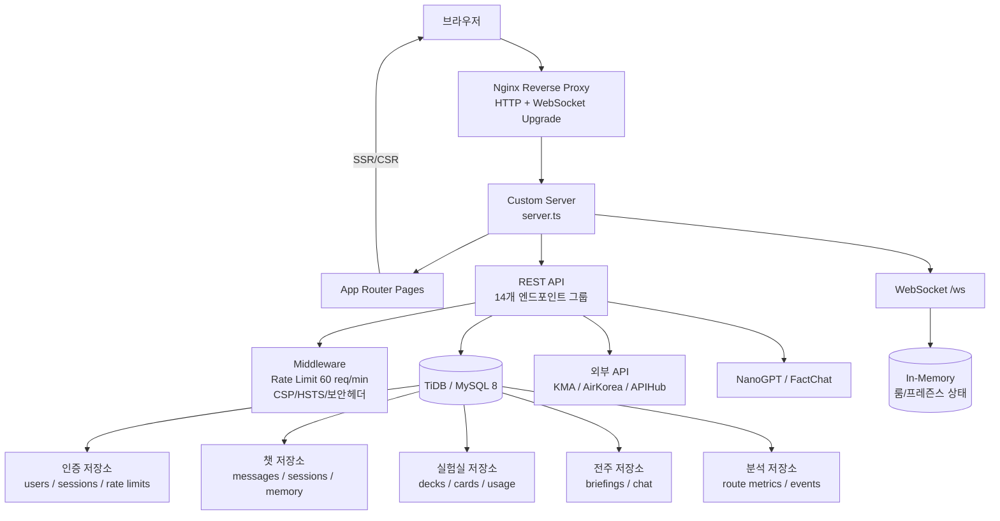
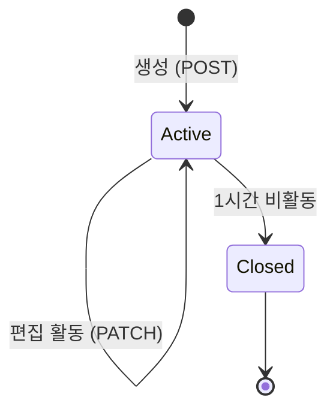

# Nadeulhae (나들해) — 통합 완전판

> 🌐 [English](README.en.md) · [中文](README.zh.md) · [日本語](README.ja.md)

**날씨·대기 데이터 기반 야외 활동 점수 서비스 + AI 대시보드 챗 + 실험실(단어암기/코드공유) + 전주 지역 브리핑**

Next.js 16 App Router 기반 풀스택 웹 애플리케이션입니다. 실시간 협업 코드 에디터, FSRS 간격 반복 학습, AI 웹검색 챗, 위치 기반 날씨 점수화 기능을 하나의 서비스로 통합 제공합니다.

---

## 목차

1. [기술 스택](#1-기술-스택)
2. [프로젝트 구조](#2-프로젝트-구조)
3. [아키텍처](#3-아키텍처)
4. [기능별 상세](#4-기능별-상세)
   - [날씨 인텔리전스](#41-날씨-인텔리전스)
   - [대시보드 AI 챗](#42-대시보드-ai-챗)
   - [실험실 (Lab)](#43-실험실-lab)
   - [코드 공유](#44-코드-공유)
   - [전주 데일리 브리핑](#45-전주-데일리-브리핑)
   - [통계 캘린더](#46-통계-캘린더)
5. [API 레퍼런스](#5-api-레퍼런스)
6. [WebSocket 명세](#6-websocket-명세)
7. [데이터베이스](#7-데이터베이스)
8. [보안](#8-보안)
9. [인증 시스템](#9-인증-시스템)
10. [로컬 개발 환경](#10-로컬-개발-환경)
11. [테스트](#11-테스트)
12. [프로덕션 배포](#12-프로덕션-배포)
13. [환경변수](#13-환경변수)
14. [트러블슈팅](#14-트러블슈팅)
15. [알려진 이슈 및 로드맵](#15-알려진-이슈-및-로드맵)
16. [디렉토리 맵](#16-디렉토리-맵)

---

## 1. 기술 스택

| 계층 | 기술 |
|------|------|
| **프레임워크** | Next.js 16.2 (App Router) |
| **언어** | TypeScript 6.0 |
| **런타임** | Node.js (커스텀 서버 `server.ts` + WebSocket) |
| **프론트엔드** | React 19, TailwindCSS 4, Framer Motion, CodeMirror 6 |
| **데이터베이스** | TiDB / MySQL 8 (`mysql2/promise`) |
| **AI/LLM** | NanoGPT (주), FactChat (SAIT 3 Pro, 보조) |
| **웹검색** | Tavily API |
| **암호화** | AES-256-GCM + HKDF (필드 레벨) |
| **비밀번호** | scrypt (N=16384) + pepper |
| **배포** | PM2 + Nginx reverse proxy |
| **웹소켓** | `ws` v8 |

---

## 2. 프로젝트 구조

```
Nadeulhae/
├── README.md                          # 이 문서
├── .gitignore
├── start.command                      # macOS 개발 서버 시작 스크립트
├── api_data_list.md                   # 외부 API 문서 (gitignore)
├── fulldata_07_24_04_P_일반음식점.csv   # 음식점 CSV 데이터
├── 동네예보지점좌표(위경도)_202510.xlsx  # KMA 예보지점 좌표
└── nadeulhae/                         # 메인 애플리케이션 루트
    ├── server.ts                      # 커스텀 HTTP + WebSocket 서버
    ├── package.json
    ├── tsconfig.json
    ├── next.config.ts                 # CSP, 리다이렉트, 이미지 최적화
    ├── postcss.config.mjs
    ├── eslint.config.mjs
    ├── .env.example                   # 환경변수 템플릿
    ├── PRODUCTION_ENV_TEMPLATE.env    # 프로덕션 환경변수 템플릿
    ├── AGENTS.md                      # AI 에이전트 가이드
    ├── docs/
    │   └── ubuntu-server-deploy-auth.md  # 배포 + 인증 가이드
    ├── scripts/                       # 14개 테스트/부트스트랩 스크립트
    ├── src/
    │   ├── app/                       # App Router 페이지 + API 라우트
    │   ├── components/                # 40+ React 컴포넌트
    │   ├── context/                   # Auth, Language React 컨텍스트
    │   ├── data/                      # 목업 데이터, JSON 정적 데이터
    │   ├── lib/                       # 60+ 핵심 비즈니스 로직 모듈
    │   └── services/                  # 프론트엔드 데이터 서비스 계층
    └── public/                        # 정적 에셋
```

---

## 3. 아키텍처



### 주요 데이터 흐름

1. **사용자 인증** → `nadeulhae_auth` httpOnly 쿠키 (scrypt 해시 → AES-256-GCM 세션)
2. **날씨 조회** → GPS/WiFi 좌표 → KMA 예보지점 변환 → 다중 API 병렬 호출 → 점수화
3. **AI 챗** → 세션 기반 컨텍스트 관리 → 시스템 프롬프트에 날씨/사용자 메모리 주입 → SSE 스트리밍 응답
4. **코드 공유** → REST CRUD + WebSocket 실시간 동기화 → 버전 체크 충돌 제어
5. **단어 암기** → FSRS 알고리즘 → 간격 반복 스케줄링 → 복습 세션

### 라우트 맵

| 경로 | 페이지 | 설명 |
|------|--------|------|
| `/` | `page.tsx` | 랜딩 — 히어로, 날씨 스코어, 시간별 예보, 브리핑 |
| `/dashboard` | `dashboard/page.tsx` | 대시보드 AI 채팅 + 날씨 컨텍스트 |
| `/lab` | `lab/page.tsx` | 실험실 허브 |
| `/lab/vocab` | `lab/vocab/page.tsx` | 간격 반복 단어 암기 |
| `/lab/ai-chat` | `lab/ai-chat/page.tsx` | AI 웹 검색 채팅 |
| `/lab/code-share` | `lab/code-share/page.tsx` | 코드 공유 세션 허브 |
| `/code-share/[sessionId]` | `code-share/[sessionId]/page.tsx` | 실시간 협업 에디터 |
| `/jeonju` | `jeonju/page.tsx` | 전주 데일리 AI 브리핑 + 지역 채팅 |
| `/statistics/calendar` | `statistics/calendar/page.tsx` | 나들이 달력 아카이브 |
| `/login`, `/signup`, `/account`, `/terms`, `/about` | 각 페이지 | 인증 및 정적 페이지 |

---

## 4. 기능별 상세

### 4.1 날씨 인텔리전스

**라우트**: `/` (랜딩), `/api/weather/*`

**제공 데이터**:
- 현재 날씨 (기온, 습도, 풍속, 강수, 적설, 하늘 상태)
- 대기질 (미세먼지 PM10/PM2.5, 통합대기지수 5종)
- 자외선 지수
- 기상특보 (전국 + 지역별)
- 시간별/주간 예보
- 위성/레이더/지진 영상 이미지
- 종합 야외활동 점수 (100점 만점)

**점수 산출 로직** (`src/app/api/weather/current/route.ts`):

점수 = 기온점수(30%) + 강수점수(25%) + 대기점수(20%) + 바람점수(15%) + 기타요인(10%) - 경보감점

**캐싱 전략**:
- 날씨/대기/자외선/특보별 독립 TTL 캐시 (60초~300초)
- 응답 전체 캐시 (현재 날씨 120초)
- AirKorea 일일 호출 쿼터 관리 (기본 500회/일)

**외부 API 의존성**:
- KMA 초단기예보 / 단기예보 / 중기예보
- AirKorea 대기질정보
- APIHub 기상특보, 기상영상

### 4.2 대시보드 AI 챗

**라우트**: `/dashboard`, `/api/chat/*`

**특징**:
- 다중 세션 관리 (생성/전환/삭제)
- 날씨 컨텍스트 자동 첨부 (현재 날씨 + 야외활동 점수)
- 크로스 세션 사용자 메모리 (선호도/관심사 자동 추출)
- 컨텍스트 초과 시 자동 압축 (12메시지 / 2400토큰 임계값)
- SSE 스트리밍 응답
- 일일 사용량 제한 (200요청/일/사용자)

**시스템 프롬프트** (`src/lib/chat/prompt.ts`):
- 날씨 인식 야외 활동 어시스턴트 페르소나
- 현재 날씨 + 점수 데이터 주입
- 크로스 세션 사용자 프로필 메모리 통합

### 4.3 실험실 (Lab)

#### 4.3.1 단어 암기 (`/lab/vocab`)

**라우트**: `/lab/vocab`, `/api/lab/*`

**알고리즘**: FSRS (Free Spaced Repetition Scheduler) v5

**주요 기능**:
- AI 기반 덱/카드 생성 (주제 + 난이도)
- 카드 자동 완성 (번역, 예문, 발음)
- 간격 반복 복습 (학습 상태: new → learning → review → relearning)
- 안정성/난이도 기반 다음 복습일 산정
- 배치 리뷰 (최대 50장)
- 학습 리포트 (정답률, 예상 유지율, 일일 통계)
- 덱 가져오기/내보내기 (JSON)

**FSRS 상태 필드** (`lab_cards` 테이블):

| 필드 | 설명 |
|------|------|
| `learning_state` | ENUM('new','learning','review','relearning') |
| `stability_days` | DECIMAL(10,4) — 기억 안정성 |
| `difficulty` | DECIMAL(6,4) — 카드 난이도 |
| `next_review_at` | DATETIME — 다음 복습 예정일 |
| `elapsed_days` | INT — 마지막 복습 경과일 |
| `lapses` | INT — 잊어버린 횟수 |

#### 4.3.2 Lab AI 챗 (`/lab/ai-chat`)

**라우트**: `/lab/ai-chat`, `/api/lab/ai-chat/*`

**특징**:
- Tavily API 웹검색 통합 (실시간 정보 검색)
- 웹검색 결과 캐싱 (세션별 상태 유지)
- 월간 웹검색 쿼터 (100회/사용자)
- 독립 세션 관리

#### 4.3.3 Lab 허브 (`/lab`)

- 실험 기능 진입점
- 기기 성능 자동 감지 (CPU 코어, 메모리)
- 저사양 기기 시각 효과 자동 축소

### 4.4 코드 공유

**라우트**: `/lab/code-share`, `/code-share/[sessionId]`, `/api/code-share/*`

**실시간 협업 코드 에디터**:
- CodeMirror 6 기반 에디터
- 언어 선택 (JavaScript, TypeScript, Python, HTML, CSS 등)
- 미로그인 게스트 참여 가능 (랜덤 닉네임)
- 1시간 비활동 시 자동 종료 (읽기 전용 보존)

**세션 생명주기**:



**동기화 전략**:
- Optimistic version 기반 충돌 제어 → `409 version_conflict` 시 클라이언트 자동 재동기화
- `code_share_saved` 신호 + 2.5초 폴링 fallback으로 유실 방지
- 재입장 시 세션 상세 재조회 + presence 재구독

**게스트 신원**:
- 쿠키 기반 actor/alias 발급 (`nadeulhae_code_share_actor`, `nadeulhae_code_share_alias`)
- 비회원도 링크 입장 가능
- 랜덤 닉네임 자동 생성 (형용사 + 동물)
- 삭제는 생성자(actor/user)만 가능

### 4.5 전주 데일리 브리핑

**라우트**: `/jeonju`, `/api/jeonju/*`

**특징**:
- AI 생성 일일 지역 브리핑 (날씨, 이벤트, 안전정보)
- 전주 로컬 챗 (익명 또는 인증)
- 7일 메시지 보존 정책
- 웹검색 결과 기반 뉴스 요약

### 4.6 통계 캘린더

**라우트**: `/statistics/calendar`

- 일별 야외 활동 기록 캘린더 뷰
- 활동 점수 히스토리

---

## 5. API 레퍼런스

### 5.1 인증 (`/api/auth/*`)

| 메서드 | 경로 | 설명 | 인증 |
|--------|------|------|------|
| `POST` | `/api/auth/register` | 회원가입 | ✗ |
| `POST` | `/api/auth/login` | 로그인 (세션 쿠키 발급) | ✗ |
| `GET` | `/api/auth/me` | 현재 세션/사용자 조회 | ✓ |
| `POST` | `/api/auth/logout` | 로그아웃 (쿠키 제거) | ✓ |
| `GET` | `/api/auth/profile` | 프로필 조회 | ✓ |
| `PUT` | `/api/auth/profile` | 프로필 수정 | ✓ |
| `DELETE` | `/api/auth/account` | 계정 삭제 (연쇄 데이터 제거) | ✓ |

### 5.2 날씨 (`/api/weather/*`)

| 메서드 | 경로 | 설명 |
|--------|------|------|
| `GET` | `/api/weather/current` | 현재 날씨, 대기질, 특보, 점수 |
| `GET` | `/api/weather/forecast` | 시간별/주간 예보 |
| `GET` | `/api/weather/images` | 위성/레이더/지진 이미지 |
| `GET` | `/api/weather/images/asset` | 생성된 기상특보 이미지 에셋 |
| `GET` | `/api/weather/archives` | 과거 날씨 아카이브 |
| `GET` | `/api/weather/trends` | 날씨 트렌드 분석 |
| `GET` | `/api/weather/insights` | AI 생성 인사이트 |
| `POST` | `/api/weather/recommendations/generate` | AI 야외 활동 코스 추천 |
| `GET` | `/api/fire/summary` | 산불 요약 정보 |

### 5.3 대시보드 챗 (`/api/chat/*`)

| 메서드 | 경로 | 설명 |
|--------|------|------|
| `GET` | `/api/chat` | 챗 상태 조회 (세션, 메시지, 메모리) |
| `POST` | `/api/chat` | 메시지 전송 (SSE 스트리밍 지원) |
| `GET` | `/api/chat/sessions` | 세션 목록 |
| `POST` | `/api/chat/sessions` | 세션 생성 |
| `DELETE` | `/api/chat/sessions` | 세션 삭제 |

### 5.4 Lab 단어 암기 (`/api/lab/*`)

| 메서드 | 경로 | 설명 |
|--------|------|------|
| `GET` | `/api/lab/decks` | 덱 목록 |
| `POST` | `/api/lab/decks` | 덱 생성 |
| `GET` | `/api/lab/cards` | 카드 목록 |
| `POST` | `/api/lab/cards` | 카드 생성 |
| `POST` | `/api/lab/cards/autofill` | AI 카드 자동 완성 |
| `POST` | `/api/lab/generate` | AI 덱 생성 |
| `POST` | `/api/lab/review` | 단일 카드 복습 제출 |
| `POST` | `/api/lab/review/batch` | 배치 복습 제출 |
| `GET` | `/api/lab/report` | 학습 리포트 |
| `POST` | `/api/lab/import` | 덱 가져오기 |
| `GET` | `/api/lab/export` | 덱 내보내기 |
| `GET` | `/api/lab/template` | 템플릿 데이터 |
| `GET` | `/api/lab/state` | 실험실 상태 |

### 5.5 Lab AI 챗 (`/api/lab/ai-chat/*`)

| 메서드 | 경로 | 설명 |
|--------|------|------|
| `GET` | `/api/lab/ai-chat/sessions` | 세션 목록 |
| `POST` | `/api/lab/ai-chat/sessions` | 세션 생성 |
| `POST` | `/api/lab/ai-chat` | 메시지 전송 (웹검색 연동 SSE) |

### 5.6 코드 공유 (`/api/code-share/*`)

| 메서드 | 경로 | 설명 |
|--------|------|------|
| `GET` | `/api/code-share/sessions` | 내 세션 목록 |
| `POST` | `/api/code-share/sessions` | 새 세션 생성 |
| `GET` | `/api/code-share/sessions/[sessionId]` | 세션 상세 조회 |
| `PATCH` | `/api/code-share/sessions/[sessionId]` | 코드/제목/언어 수정 (버전 체크) |
| `DELETE` | `/api/code-share/sessions/[sessionId]` | 세션 삭제 (생성자만) |

### 5.7 전주 (`/api/jeonju*`)

| 메서드 | 경로 | 설명 |
|--------|------|------|
| `GET` | `/api/jeonju/briefing` | 데일리 브리핑 조회 |
| `GET` | `/api/jeonju-chat` | 지역 챗 메시지 조회 |
| `POST` | `/api/jeonju-chat` | 메시지 전송 (익명/인증) |

### 5.8 분석 (`/api/analytics/*`)

| 메서드 | 경로 | 설명 |
|--------|------|------|
| `POST` | `/api/analytics/page-view` | 페이지 뷰 기록 |
| `POST` | `/api/analytics/consent` | 분석 동의 설정 |

---

## 6. WebSocket 명세

**엔드포인트**: `/ws`

### 6.1 연결

```
ws://localhost:3000/ws  (개발)
wss://nadeulhae.space/ws (프로덕션)
```

### 6.2 이벤트

#### Client → Server

| 이벤트 | 설명 | 페이로드 |
|--------|------|----------|
| `code_share_subscribe` | 세션 방 입장 | `{ sessionId: string }` |
| `code_share_unsubscribe` | 세션 방 이탈 | `{ sessionId: string }` |
| `code_share_typing` | 타이핑 상태 전송 | `{ sessionId: string, isTyping: boolean }` |
| `code_share_saved` | 저장 완료 신호 | `{ sessionId: string, version: number }` |

#### Server → Client

| 이벤트 | 설명 | 페이로드 |
|--------|------|----------|
| `code_share_presence` | 접속자/타이핑 상태 | `{ sessionId, onlineCount, actors[], typing[] }` |
| `code_share_patch` | API PATCH 반영 스냅샷 | `{ sessionId, version, title, code, language }` |
| `code_share_saved` | Peer 저장 신호 | `{ sessionId, version, actor }` |
| `code_share_deleted` | 세션 삭제 알림 | `{ sessionId }` |
| `user_count` | 전체 접속자 수 | `{ count: number }` |
| `weather_alert` | 기상특보 알림 | `{ message: string }` |

### 6.3 보안 가드

| 제한 | 값 |
|------|-----|
| 최대 연결 | 500 |
| 최대 메시지 크기 | 4,096 bytes |
| 클라이언트당 최대 방 | 40 |
| 방 이름 최대 길이 | 96 chars |
| Heartbeat 주기 | 30초 |
| Ping 타임아웃 | 60초 |
| Origin 검증 | allowlist 기반 |

---

## 7. 데이터베이스

### 7.1 테이블 목록 (20개)

| 테이블 | 용도 |
|--------|------|
| `users` | 사용자 계정 (암호화된 PII) |
| `user_sessions` | 세션 토큰 (SHA-256 해시) |
| `auth_attempt_buckets` | 인증 시도 rate limit |
| `auth_security_events` | 보안 감사 로그 |
| `user_chat_messages` | 대시보드 챗 메시지 |
| `user_chat_sessions` | 챗 세션 |
| `user_chat_memory` | 크로스 세션 사용자 메모리 |
| `user_chat_usage_daily` | 일일 챗 사용량 |
| `user_chat_request_events` | 챗 요청 이벤트 로그 |
| `lab_decks` | 단어 암기 덱 |
| `lab_cards` | 단어 카드 (FSRS 상태) |
| `lab_daily_usage` | 일일 Lab 사용량 |
| `lab_ai_chat_messages` | Lab AI 챗 메시지 |
| `lab_ai_chat_sessions` | Lab AI 챗 세션 |
| `lab_ai_chat_usage_daily` | Lab AI 챗 사용량 |
| `lab_ai_chat_web_search_state` | 웹검색 상태/캐시 |
| `code_share_sessions` | 코드 공유 세션 |
| `jeonju_daily_briefings` | 전주 브리핑 |
| `jeonju_chat_messages` | 전주 지역 챗 |
| `llm_global_usage_daily` | 전역 LLM 사용량 |
| `analytics_daily_*` (5개) | 분석 메트릭 |

### 7.2 스키마 부트스트랩

```bash
# 인증 + 사용자 테이블
node scripts/bootstrap-auth-db.mjs

# 예보지점 데이터
node scripts/bootstrap-forecast-location-db.mjs
```

---

## 8. 보안

### 8.1 데이터 보호

| 메커니즘 | 구현 |
|-----------|------|
| **필드 암호화** | AES-256-GCM, 필드별 HKDF 컨텍스트 키 |
| **블라인드 인덱스** | HMAC-SHA256 (복호화 없이 이메일/닉네임 조회) |
| **암호화 형식** | `enc:v1:<salt>:<iv>:<authTag>:<encrypted>` (base64url) |
| **마이그레이션** | 평문 → 암호화 자동 배치 마이그레이션 |
| **암호화 대상** | email, display_name, nickname, age_band, interests, IP, UA, 챗 내용 |

### 8.2 전송 계층

| 헤더 | 값 |
|------|-----|
| `Strict-Transport-Security` | max-age=63072000; includeSubDomains; preload |
| `Content-Security-Policy` | script-src, connect-src, img-src 제한 |
| `X-Content-Type-Options` | nosniff |
| `X-Frame-Options` | DENY |
| `Referrer-Policy` | strict-origin-when-cross-origin |
| `Permissions-Policy` | 카메라/마이크/지오로케이션 제한 |
| 쿠키 | httpOnly, SameSite=Lax, Secure (프로덕션) |

### 8.3 Rate Limiting

| 계층 | 범위 | 제한 |
|------|------|------|
| **글로벌 미들웨어** | IP당 `/api/*` | 60 req/min |
| **인증 뮤테이션** | IP + 엔드포인트 | 20 req/min |
| **로그인** | IP당 / 이메일당 | 10회/15분, 차단 15분 |
| **회원가입** | IP당 / 이메일당 | 6회/60분, 차단 60분 |
| **LLM 전역** | 전체 사이트 | 5,000 req/일 |
| **LLM 사용자** | 사용자 + 액션별 | 100~200 req/일 |

### 8.4 요청 검증

- `Sec-Fetch-Site` + `Origin` 헤더 교차 검증
- `Content-Type: application/json` 강제 (뮤테이션)
- 본문 크기 제한 (16KB 인증, 4096B WebSocket)
- `SELECT ... FOR UPDATE`를 통한 원자적 rate limit

---

## 9. 인증 시스템

### 9.1 비밀번호 처리

```
salt = randomBytes(16)
peppered = password + AUTH_PEPPER
hash = scrypt(peppered, salt, N=16384, r=8, p=1, keylen=64)
stored = "${salt}.${hash}"
```

- **Timing attack 방어**: 존재하지 않는 사용자도 더미 scrypt 연산 수행
- **Pepper**: `AUTH_PEPPER` 환경변수 (코드/DB에 미저장)

### 9.2 세션 관리

| 속성 | 값 |
|------|-----|
| 토큰 생성 | `randomBytes(32)` → hex |
| DB 저장 | SHA-256 해시 |
| 쿠키 이름 | `nadeulhae_auth` |
| 기본 TTL | 7일 |
| 최대 TTL | 30일 |
| 갱신 윈도우 | 24시간 |
| 최대 세션 | 사용자당 5개 |
| 인메모리 캐시 | TTL 15초, touch debounce 60초 |

### 9.3 계정 삭제

- 10+ 테이블에서 사용자 데이터 연쇄 삭제 (트랜잭션)
- 삭제 대상: users, sessions, 챗 메시지/세션, 코드공유 세션, Lab 데이터, 전주 챗, 분석 데이터

---

## 10. 로컬 개발 환경

### 10.1 사전 요구사항

- Node.js 20+
- MySQL 8 / TiDB (로컬 또는 원격)
- 환경변수 설정 (`.env.local`)

### 10.2 설치

```bash
cd nadeulhae
npm install
cp .env.example .env.local
# .env.local 파일을 실제 값으로 편집
```

### 10.3 개발 서버

```bash
# 기본 Next.js dev (WebSocket 미지원)
npm run dev
# → http://localhost:3000

# 또는 macOS 시작 스크립트
open start.command
```

### 10.4 실시간 기능 검증 (Full Server)

```bash
npm run build
NODE_ENV=production PORT=3000 npm run start
# → HTTP + WebSocket 모두 활성화
```

---

## 11. 테스트

### 11.1 필수 점검

```bash
npm run lint        # ESLint
npm run build       # Next.js 빌드 (타입 체크 포함)
npm run test:lab    # Lab 기능 통합 테스트
```

### 11.2 통합 테스트 스크립트

```bash
# 인증 플로우
node scripts/test-auth-flows.mjs

# 챗 플로우
node scripts/test-chat-flow.mjs

# Lab 기능
node scripts/test-lab-features.mjs

# Lab AI 챗
node scripts/test-lab-ai-chat-flow.mjs

# 코드 공유 WebSocket
# Terminal 1:
NODE_ENV=production PORT=3101 npm run start
# Terminal 2:
npm run test:code-share
```

### 11.3 DB 검증

```bash
node scripts/verify-db-and-auth.mjs
node scripts/verify-forecast-location-db.mjs
```

---

## 12. 프로덕션 배포

### 12.1 PM2

```bash
cd /home/<user>/web/Nadeulhae/nadeulhae
npm install --include=dev
npm run build
NODE_ENV=production pm2 start npm --name nadeulhae \
  --cwd /home/<user>/web/Nadeulhae/nadeulhae \
  -- run start
pm2 save
```

### 12.2 Nginx Reverse Proxy

```nginx
server {
    listen 443 ssl http2;
    server_name nadeulhae.space www.nadeulhae.space;

    location / {
        proxy_pass http://127.0.0.1:3000;
        proxy_http_version 1.1;
        proxy_set_header Host $host;
        proxy_set_header X-Real-IP $remote_addr;
        proxy_set_header X-Forwarded-For $proxy_add_x_forwarded_for;
        proxy_set_header X-Forwarded-Proto $scheme;

        # WebSocket upgrade
        proxy_set_header Upgrade $http_upgrade;
        proxy_set_header Connection "upgrade";
        proxy_read_timeout 86400s;
    }
}
```

> 상세 배포 가이드: `nadeulhae/docs/ubuntu-server-deploy-auth.md`

---

## 13. 환경변수

기준 파일: `nadeulhae/.env.example`

### 필수

| 변수 | 설명 |
|------|------|
| `KMA_API_KEY` | 기상청 API 인증키 |
| `AIRKOREA_API_KEY` | 한국환경공단 대기질 API 키 |
| `APIHUB_KEY` | APIHub 기상특보/영상 키 |
| `DB_HOST` | MySQL/TiDB 호스트 |
| `DB_PORT` | DB 포트 |
| `DB_USER` | DB 사용자 |
| `DB_PASSWORD` | DB 비밀번호 |
| `DB_NAME` | DB 이름 |
| `AUTH_PEPPER` | 비밀번호 pepper (64+ 랜덤 hex) |
| `DATA_PROTECTION_KEY` | 필드 암호화 마스터키 (64+ 랜덤 hex) |
| `NANOGPT_API_KEY` | NanoGPT API 키 |
| `NANOGPT_BASE_URL` | NanoGPT API 엔드포인트 |
| `APP_BASE_URL` | 프로덕션 도메인 (예: `https://nadeulhae.space`) |

### 선택

| 변수 | 기본값 | 설명 |
|------|--------|------|
| `FACTCHAT_API_KEY` | - | FactChat 폴백 API 키 |
| `TAVILY_API_KEY` | - | 웹검색 API 키 |
| `AUTH_COOKIE_NAME` | `nadeulhae_auth` | 인증 쿠키명 |
| `ALWAYS_SECURE_COOKIES` | `false` | 항상 Secure 쿠키 |
| `TRUST_PROXY_HEADERS` | `false` | X-Forwarded-* 신뢰 |
| `HOST` | `0.0.0.0` | 서버 바인드 주소 |
| `PORT` | `3000` | 서버 포트 |
| `AIRKOREA_DAILY_LIMIT` | `500` | AirKorea 일일 호출 한도 |
| `AUTH_SESSION_CACHE_TTL_MS` | `15000` | 세션 캐시 TTL |
| `DB_CA_PATH` | - | DB TLS CA 인증서 경로 |

---

## 14. 트러블슈팅

### 14.1 `502 Bad Gateway`

**원인**: PM2 경로 불일치 / 빌드 누락 / Nginx 포트 불일치

```bash
pm2 ls
pm2 describe nadeulhae
pm2 logs nadeulhae --lines 200
curl -I http://127.0.0.1:3000
```

### 14.2 `Can't resolve 'tailwindcss'`

**원인**: 실행 cwd가 `nadeulhae/`가 아닌 상위 디렉토리

```bash
cd nadeulhae && npm run dev
```

### 14.3 코드 공유 "연결 재시도 중"

**원인**: `npm run dev`로 실행 (WS 미지원) / Nginx Upgrade 헤더 누락

**해결**: `NODE_ENV=production npm run start` 사용, Nginx 설정 확인

### 14.4 LLM 응답 없음

**원인**: 일일 쿼터 소진 / API 키 누락

```bash
# 쿼터 확인
node scripts/reset-chat-and-accounts.mjs
```

---

## 15. 알려진 이슈 및 로드맵

### 15.1 보안 (CRITICAL)

- [ ] **WebSocket 방 구독 인증 추가** — 게스트가 유효한 sessionId 추측만으로 모든 세션 접근 가능 (`server.ts:385`)
- [ ] **비밀번호 변경 시 기존 세션 무효화** — 현재 세션이 유지됨 (`auth/repository.ts:552`)
- [ ] **`__Host-` 쿠키 프리픽스 적용** — 서브도메인 쿠키 인젝션 방어
- [ ] **암호화 키 로테이션 메커니즘** — `DATA_PROTECTION_KEY` 교체 시 재암호화 유틸

### 15.2 성능 (HIGH)

- [ ] **Station 조회를 Promise.all 내로 이동** — 7개 병렬 fetch 불필요한 지연 제거 (`weather/current/route.ts:1105`)
- [ ] **AirKorea 쿼터 atomic counter** — 동시 요청 시 초과 방지 (`weather/current/route.ts:238`)
- [ ] **Lab 리포트 쿼리 최적화** — 9개 subquery → 1개 집계 쿼리 (`lab/repository.ts:885`)
- [ ] **Card 배치 INSERT 적용** — N+1 → 단일 배치 (`lab/repository.ts:701`)
- [ ] **복합 인덱스 추가** — `user_chat_messages(user_id, session_id, id)`, `lab_cards(user_id, next_review_at)` 등 6건
- [ ] **LLM 트래픽 Redis/분산락 도입** — 글로벌 `FOR UPDATE` 락 제거

### 15.3 안정성 (HIGH)

- [ ] **JSON.parse try-catch 추가** — `fetchJsonSafely` 예외 처리 (`weather/current/route.ts:623`)
- [ ] **GPS 좌표 응답에서 제거** — 프라이버시 누출 (`weather/current/route.ts:1330`)
- [ ] **WebSocket Presence 누수 수정** — broadcast 경로 cleanup (`broadcast.ts:275`)

### 15.4 확장성 (MEDIUM)

- [ ] **Redis pub/sub 도입** — 멀티 인스턴스 WebSocket fanout
- [ ] **Rate limiter 외부화** — `Map` 기반 → Redis 기반
- [ ] **분석 이벤트 큐잉** — DB 직접 쓰기 → 메시지 큐 + 배치
- [ ] **Code Share 비활동 정리 cron화** — API 의존 → `setInterval` 기반

### 15.5 코드 품질 (MEDIUM)

- [ ] **Bulletin 파싱 로직 공통화** — `dashboard/page.tsx` ↔ `picnic-briefing.tsx` 200줄 중복
- [ ] **Giant 컴포넌트 분할** — `picnic-briefing.tsx` (890줄), `dashboard/page.tsx` (941줄), `weather/current/route.ts` (1391줄)
- [ ] **`React.memo` 적용** — `DashboardWorkspace`, `TodayHourlyForecast`, `WeatherImagePanel`

---

## 16. 디렉토리 맵

```
nadeulhae/src/
├── app/
│   ├── page.tsx                          # 랜딩 (날씨 점수 히어로)
│   ├── layout.tsx                        # 루트 레이아웃
│   ├── dashboard/page.tsx                # 대시보드 챗
│   ├── lab/
│   │   ├── page.tsx                      # Lab 허브
│   │   ├── vocab/page.tsx                # 단어 암기
│   │   ├── ai-chat/page.tsx              # AI 챗 (웹검색)
│   │   └── code-share/page.tsx           # 코드공유 허브
│   ├── code-share/[sessionId]/page.tsx   # 실시간 에디터
│   ├── jeonju/page.tsx                   # 전주 브리핑 + 챗
│   ├── statistics/calendar/page.tsx      # 활동 캘린더
│   ├── login/page.tsx, signup/page.tsx   # 인증 페이지
│   ├── account/page.tsx                  # 계정 관리
│   ├── terms/page.tsx, about/page.tsx    # 정적 페이지
│   └── api/                              # 14개 API 라우트 그룹
│       ├── auth/register,login,me,logout,profile,account/
│       ├── weather/current,forecast,images,archives,trends,insights,recommendations/
│       ├── fire/summary/
│       ├── chat/,chat/sessions/
│       ├── lab/decks,cards,generate,review,report,import,export,template,state/
│       ├── lab/ai-chat/,ai-chat/sessions/
│       ├── code-share/sessions/,sessions/[sessionId]/
│       ├── jeonju/briefing/,jeonju-chat/
│       └── analytics/page-view/,consent/
├── components/
│   ├── weather/                          # 날씨 카드, 점수 패널, 차트
│   ├── chat/                             # 챗 패널, 메시지 목록
│   ├── lab/                              # 덱/카드 UI, 에디터
│   ├── code-share/                       # 코드 에디터, 참여자 목록
│   ├── jeonju/                           # 브리핑, 챗 패널
│   ├── auth/                             # 로그인/회원가입 폼
│   ├── layout/                           # 헤더, 네비게이션, 푸터
│   └── ui/                               # 공통 UI (버튼, 모달 등)
├── context/
│   ├── auth-context.tsx                  # 인증 상태 (React Context)
│   └── language-context.tsx              # 다국어 (ko/en)
├── data/
│   ├── mockData.ts                       # 날씨 목업 데이터
│   ├── regionProfiles.json               # 지역 프로필
│   └── forecastLocationData.json         # 예보지점 데이터
├── lib/
│   ├── db.ts                             # MySQL 커넥션 풀
│   ├── proxy.ts                          # 미들웨어 (rate limit, 보안헤더)
│   ├── utils.ts                          # 범용 유틸리티
│   ├── performance.ts                    # 기기 성능 감지
│   ├── weather-utils.ts                  # 날씨 계산 유틸
│   ├── coords-utils.ts                   # WGS84 ↔ TM 좌표계
│   ├── request-session.ts                # 익명 세션 쿠키
│   ├── auth/                             # 인증 (10개 파일)
│   │   ├── types.ts, schema.ts, repository.ts, session.ts
│   │   ├── password.ts, validation.ts, guardrails.ts
│   │   ├── request-security.ts, messages.ts, profile-options.ts
│   ├── security/
│   │   └── data-protection.ts            # AES-256-GCM 암호화
│   ├── chat/                             # 대시보드 챗 (7개 파일)
│   │   ├── schema.ts, repository.ts, types.ts, constants.ts
│   │   ├── prompt.ts, nanogpt.ts, factchat.ts
│   ├── lab/                              # Lab 단어 암기 (7개 파일)
│   │   ├── schema.ts, repository.ts, types.ts, constants.ts
│   │   ├── management.ts, prompt.ts, transfer.ts
│   ├── lab-ai-chat/                      # Lab AI 챗 (6개 파일)
│   │   ├── schema.ts, repository.ts, types.ts, constants.ts
│   │   ├── prompt.ts, web-search.ts
│   ├── code-share/                       # 코드 공유 (5개 파일)
│   │   ├── schema.ts, repository.ts, types.ts, constants.ts, actor.ts
│   ├── websocket/                        # WebSocket (3개 파일)
│   │   ├── server.ts, broadcast.ts, use-websocket.ts
│   ├── nanogpt/client.ts                 # NanoGPT HTTP 클라이언트
│   ├── tavily/client.ts                  # Tavily 웹검색 클라이언트
│   ├── jeonju-briefing/                  # 전주 브리핑 (schema, repo, service)
│   ├── jeonju-chat/                      # 전주 챗 (schema, repo)
│   ├── analytics/                        # 분석 (schema, repo, route, consent)
│   ├── llm/quota.ts                      # LLM 쿼터 관리
│   ├── privacy/                          # 위치 증명, 데이터 보존
│   ├── forecast-location/repository.ts   # 예보지점 DB 조회
│   ├── time/server-time.ts               # 서버 시간 유틸
│   └── markdown/                         # 마크다운 살균, 코드 하이라이팅
├── services/
│   └── dataService.ts                    # 프론트엔드 API 호출 계층
└── proxy.ts                              # Next.js 미들웨어 진입점
```

---

> **마지막 업데이트**: 2026-04-29
> **코드베이스 기준**: Next.js 16.2, TypeScript 6.0, TiDB/MySQL 8, ws v8
> **분석 기준**: 6개 영역, 97건 이슈 발굴
