# 나들해 (Nadeulhae) — Architecture & UML Documentation

> **Version**: 0.1.0 | **Framework**: Next.js 16.2.4 (App Router) | **Language**: TypeScript 6.0

---

## 1. 프로젝트 개요 (Project Overview)

**Nadeulhae**("나들이" + "해")는 **날씨 기반 야외활동 점수 서비스 + AI Chat + 코드 공유 플랫폼**이다. 전주시를 중심으로 기상청(KMA)·한국환경공단(AirKorea)·APIHub의 실시간 데이터를 결합해 0~100점의 피크닉 지수를 산출하고, NanoGPT/FactChat 기반의 AI 채팅, FSRS 알고리즘을 활용한 어휘 암기(Lab), 그리고 WebSocket 기반 실시간 협업 코드 에디터를 제공한다.

---

## 2. System Architecture — Deployment Diagram

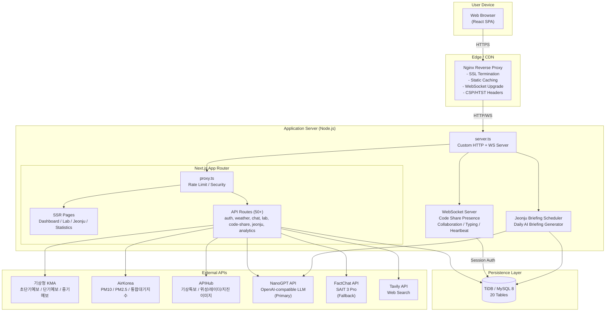

---

## 3. Frontend Component Hierarchy — Component Tree

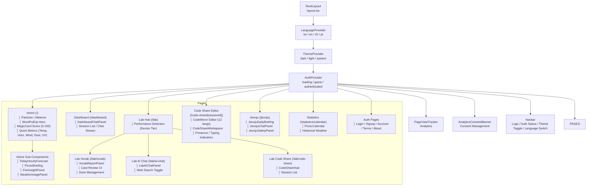

---

## 4. Database Schema — Entity-Relationship Diagram (ERD)

> **범례**  
> 🔒 = AES-256-GCM 암호화 필드  
> 🏷️ = Blind Index (HMAC-SHA256) 검색용  
> ⚡ = Indexed column

```mermaid
erDiagram
    users {
        CHAR36 id PK "UUID"
        VARCHAR700 email 🔒 "AES-256-GCM"
        CHAR64 email_hash 🏷️⚡ "HMAC-SHA256 Blind Index | UNIQUE"
        VARCHAR255 display_name 🔒 "화면 표시 이름"
        VARCHAR700 nickname 🔒 "닉네임"
        CHAR64 nickname_hash 🏷️⚡ "Blind Index | UNIQUE with tag"
        CHAR4 nickname_tag "랜덤 4자리 태그 (중복방지)"
        CHAR128 password_hash "scrypt(N=16384)"
        CHAR32 password_salt "scrypt salt"
        VARCHAR24 password_algo "scrypt-v1"
        VARCHAR700 age_band 🔒 "연령대"
        VARCHAR700 primary_region 🔒 "주 활동 지역"
        LONGTEXT interest_tags 🔒 "JSON 관심사 배열"
        VARCHAR512 interest_other 🔒 "기타 관심사"
        VARCHAR700 preferred_time_slot 🔒 "선호 시간대"
        LONGTEXT weather_sensitivity 🔒 "JSON 날씨 민감도 배열"
        DATETIME terms_agreed_at
        DATETIME privacy_agreed_at
        DATETIME age_confirmed_at
        TINYINT1 marketing_accepted
        TINYINT1 analytics_accepted
        TINYINT1 lab_enabled "Lab 기능 활성화 여부"
        DATETIME created_at
        DATETIME updated_at
    }

    user_sessions {
        CHAR36 id PK "UUID"
        CHAR36 user_id FK ⚡
        CHAR64 token_hash ⚡ "SHA-256(Session Token) | UNIQUE"
        DATETIME expires_at ⚡
        VARCHAR700 user_agent 🔒
        VARCHAR700 ip_address 🔒
        DATETIME created_at
        DATETIME last_used_at
    }

    auth_attempt_buckets {
        BIGINT id PK "AUTO_INCREMENT"
        VARCHAR32 action "login | register | etc"
        VARCHAR191 scope_key "IP or email_hash"
        INT attempt_count
        DATETIME window_started_at
        DATETIME blocked_until ⚡
        DATETIME last_attempt_at
        UNIQUE action_scope UNIQUE "action, scope_key"
    }

    auth_security_events {
        BIGINT id PK "AUTO_INCREMENT"
        VARCHAR48 event_type
        VARCHAR24 action
        VARCHAR24 outcome "success | failure"
        CHAR36 user_id FK ⚡
        VARCHAR700 email 🔒
        CHAR64 email_hash 🏷️⚡
        VARCHAR700 ip_address 🔒
        VARCHAR700 user_agent 🔒
        JSON metadata
        DATETIME created_at ⚡
    }

    user_chat_sessions {
        BIGINT id PK "AUTO_INCREMENT"
        CHAR36 user_id FK ⚡
        VARCHAR512 title
        VARCHAR8 locale "ko | en | zh | ja"
        TINYINT1 is_auto_title
        LONGTEXT memory_summary_text 🔒 "Context summary"
        INT memory_token_estimate
        INT summarized_message_count
        VARCHAR120 memory_model_used
        DATETIME last_compacted_at
        DATETIME last_message_at ⚡
        DATETIME created_at ⚡
        DATETIME updated_at ⚡
    }

    user_chat_messages {
        BIGINT id PK "AUTO_INCREMENT"
        CHAR36 user_id FK ⚡
        BIGINT session_id FK ⚡
        VARCHAR16 role "user | assistant | system"
        VARCHAR8 locale
        LONGTEXT content 🔒 "AES-256-GCM"
        VARCHAR128 provider_message_id
        VARCHAR120 requested_model
        VARCHAR120 resolved_model
        INT prompt_tokens
        INT completion_tokens
        INT total_tokens
        INT cached_prompt_tokens
        DATETIME included_in_memory_at ⚡
        DATETIME created_at ⚡
    }

    user_chat_memory {
        CHAR36 user_id PK "FK to users"
        LONGTEXT summary_text 🔒 "Cross-session memory"
        LONGTEXT assessment_text 🔒 "User profile assessment"
        INT summary_token_estimate
        INT summarized_message_count
        BIGINT last_profile_message_id
        VARCHAR120 model_used
        VARCHAR120 profile_model_used
        DATETIME last_compacted_at
        DATETIME profile_refreshed_at
        DATETIME updated_at
    }

    user_chat_usage_daily {
        DATE metric_date PK
        CHAR36 user_id PK ⚡
        INT request_count
        INT success_count
        INT failure_count
        BIGINT prompt_tokens
        BIGINT completion_tokens
        BIGINT total_tokens
        BIGINT cached_prompt_tokens
        DATETIME last_used_at ⚡
    }

    user_chat_request_events {
        BIGINT id PK "AUTO_INCREMENT"
        CHAR36 user_id FK ⚡
        BIGINT session_id FK ⚡
        VARCHAR16 request_kind ⚡
        VARCHAR24 status ⚡
        VARCHAR8 locale
        VARCHAR120 requested_model
        VARCHAR120 resolved_model
        VARCHAR128 provider_request_id
        INT message_count
        INT input_characters
        INT output_characters
        INT prompt_tokens
        INT completion_tokens
        INT total_tokens
        INT cached_prompt_tokens
        INT latency_ms
        VARCHAR64 error_code
        VARCHAR255 error_message
        DATETIME created_at ⚡
    }

    lab_decks {
        BIGINT id PK "AUTO_INCREMENT"
        CHAR36 user_id FK ⚡
        VARCHAR8 locale
        LONGTEXT title_text
        LONGTEXT topic_text
        VARCHAR191 requested_model
        VARCHAR191 resolved_model
        INT card_count
        DATETIME created_at ⚡
        DATETIME updated_at
    }

    lab_cards {
        BIGINT id PK "AUTO_INCREMENT"
        BIGINT deck_id FK ⚡
        CHAR36 user_id FK ⚡
        LONGTEXT term_text "어휘 단어"
        LONGTEXT meaning_text "의미/해석"
        LONGTEXT example_text "예문"
        LONGTEXT example_translation_text "예문 번역"
        LONGTEXT pos_text "품사"
        LONGTEXT tip_text "팁/비고"
        VARCHAR16 learning_state ⚡ "new | learning | review | relearning"
        TINYINT consecutive_correct
        TINYINT stage "0-8 (FSRS)" 
        DOUBLE stability_days "FSRS stability"
        DOUBLE difficulty "FSRS difficulty (1-10)"
        INT total_reviews
        INT lapses
        TINYINT last_review_outcome "0=again, 1=hard, 2=good, 3=easy"
        DATETIME next_review_at ⚡ "FSRS scheduled review time"
        DATETIME last_reviewed_at
        DATETIME created_at
        DATETIME updated_at
    }

    lab_daily_usage {
        DATE metric_date PK
        CHAR36 user_id PK ⚡
        INT generation_count
        INT review_count
        DATETIME created_at
        DATETIME updated_at
    }

    lab_ai_chat_sessions {
        BIGINT id PK "AUTO_INCREMENT"
        CHAR36 user_id FK ⚡
        LONGTEXT title_text
        VARCHAR8 locale
        LONGTEXT memory_summary_text
        INT memory_token_estimate
        INT summarized_message_count
        VARCHAR191 memory_model_used
        DATETIME last_compacted_at
        DATETIME last_message_at ⚡
        DATETIME created_at ⚡
        DATETIME updated_at ⚡
    }

    lab_ai_chat_messages {
        BIGINT id PK "AUTO_INCREMENT"
        CHAR36 user_id FK ⚡
        BIGINT session_id FK ⚡
        VARCHAR16 role
        VARCHAR8 locale
        LONGTEXT content
        VARCHAR128 provider_message_id
        VARCHAR191 requested_model
        VARCHAR191 resolved_model
        INT prompt_tokens
        INT completion_tokens
        INT total_tokens
        INT cached_prompt_tokens
        DATETIME included_in_memory_at ⚡
        DATETIME created_at ⚡
    }

    lab_ai_chat_web_search_state {
        CHAR36 user_id PK "FK to users"
        BIGINT session_id PK "Composite PK"
        INT session_call_count
        INT fallback_call_count
        LONGTEXT cache_query_text
        LONGTEXT cache_result_text
        VARCHAR16 cache_topic
        VARCHAR16 cache_time_range
        DATE cache_start_date
        DATE cache_end_date
        INT cache_result_count
        DATETIME cache_updated_at ⚡
        DATETIME created_at
        DATETIME updated_at ⚡
    }

    code_share_sessions {
        BIGINT id PK "AUTO_INCREMENT"
        VARCHAR48 session_id UK ⚡ "UNIQUE, public session token"
        CHAR36 owner_actor_id ⚡ "Guest actor UUID"
        CHAR36 owner_user_id ⚡ "Optional auth user ID"
        VARCHAR191 title_text
        VARCHAR64 language_code "javascript | python | go | etc."
        LONGTEXT code_text "Code content"
        VARCHAR16 status ⚡ "active | closed"
        INT version "Optimistic concurrency"
        DATETIME last_activity_at ⚡
        DATETIME closed_at
        DATETIME created_at
        DATETIME updated_at
    }

    llm_global_usage_daily {
        DATE metric_date PK "Asia/Seoul date"
        INT request_count "Atomic counter (FOR UPDATE)"
        INT success_count
        INT failure_count
        DATETIME last_used_at ⚡
    }

    llm_user_action_usage_daily {
        DATE metric_date PK "Composite PK"
        CHAR36 user_id PK "Composite PK"
        VARCHAR64 quota_key PK "Composite PK | e.g. 'chat_message'"
        INT request_count
        INT success_count
        INT failure_count
        DATETIME last_used_at ⚡
    }

    analytics_daily_route_metrics {
        DATE metric_date PK
        CHAR64 dimension_key PK "SHA-256 hash of all dims"
        VARCHAR16 route_kind ⚡ "page | api"
        VARCHAR191 route_path ⚡
        VARCHAR16 method "GET | POST | PUT | DELETE"
        SMALLINT status_code
        VARCHAR8 status_group "2xx | 3xx | 4xx | 5xx"
        VARCHAR16 auth_state
        VARCHAR16 device_type
        VARCHAR8 locale
        BIGINT request_count
        BIGINT unique_visitors
        BIGINT unique_users
        BIGINT total_duration_ms
        INT peak_duration_ms
        DATETIME first_seen_at
        DATETIME last_seen_at ⚡
    }

    analytics_daily_unique_entities {
        DATE metric_date PK
        CHAR64 dimension_key PK "Composite PK"
        VARCHAR16 entity_type PK "Composite PK"
        CHAR64 entity_hash PK "SHA-256 | Composite PK"
    }

    analytics_daily_actor_activity {
        DATE metric_date PK
        CHAR64 actor_key PK
        VARCHAR16 actor_type "visitor | user"
        CHAR36 user_id FK ⚡
        VARCHAR16 auth_state
        VARCHAR16 device_type
        VARCHAR8 locale
        BIGINT page_view_count
        BIGINT api_request_count
        BIGINT mutation_count
        BIGINT error_count
        DATETIME first_seen_at
        DATETIME last_seen_at ⚡
    }

    analytics_daily_page_context_metrics {
        DATE metric_date PK
        CHAR64 dimension_key PK
        VARCHAR191 route_path ⚡
        VARCHAR16 auth_state
        VARCHAR16 device_type
        VARCHAR8 locale
        VARCHAR16 theme "dark | light | system"
        VARCHAR16 viewport_bucket
        VARCHAR48 time_zone
        VARCHAR191 referrer_host
        VARCHAR32 acquisition_channel ⚡
        VARCHAR80 utm_source
        VARCHAR80 utm_medium
        VARCHAR120 utm_campaign
        BIGINT page_view_count
        BIGINT unique_visitors
        BIGINT unique_users
        BIGINT total_load_ms
        INT peak_load_ms
        DATETIME first_seen_at
        DATETIME last_seen_at ⚡
    }

    analytics_daily_consent_metrics {
        DATE metric_date PK
        CHAR64 dimension_key PK
        VARCHAR24 decision_source ⚡ "banner | settings | landing"
        VARCHAR16 consent_state ⚡ "accepted | rejected"
        VARCHAR16 auth_state
        VARCHAR16 device_type
        VARCHAR8 locale
        BIGINT decision_count
        BIGINT unique_visitors
        BIGINT unique_users
        DATETIME first_seen_at
        DATETIME last_seen_at ⚡
    }

    jeonju_daily_briefings {
        BIGINT id PK "AUTO_INCREMENT"
        DATE briefing_date
        LONGTEXT content
        VARCHAR120 model_used
        DATETIME generated_at
        DATETIME created_at
        UNIQUE date_ix UNIQUE "briefing_date"
    }

    jeonju_chat_messages {
        BIGINT id PK "AUTO_INCREMENT"
        VARCHAR36 visitor_id ⚡
        CHAR36 user_id ⚡
        VARCHAR16 role
        LONGTEXT content
        DATETIME created_at ⚡
    }

    %% ----- Relationships -----
    users ||--o{ user_sessions : "has"
    users ||--o{ user_chat_sessions : "owns"
    users ||--o{ user_chat_messages : "sends"
    users ||--|| user_chat_memory : "has"
    users ||--o{ lab_decks : "owns"
    users ||--o{ lab_cards : "owns"
    users ||--o{ lab_ai_chat_sessions : "owns"
    users ||--o{ lab_ai_chat_messages : "sends"
    users ||--o{ llm_user_action_usage_daily : "consumes"
    users ||--o{ analytics_daily_actor_activity : "generates"
    users ||--o{ code_share_sessions : "creates"
    users ||--o{ jeonju_chat_messages : "writes"
    
    user_chat_sessions ||--o{ user_chat_messages : "contains"
    user_chat_sessions ||--o{ user_chat_request_events : "tracks"
    lab_decks ||--o{ lab_cards : "contains"
    lab_ai_chat_sessions ||--o{ lab_ai_chat_messages : "contains"
    lab_ai_chat_sessions ||--|| lab_ai_chat_web_search_state : "has"
```

---

## 5. Authentication Flow — Sequence Diagram

```mermaid
sequenceDiagram
    actor User
    participant Browser as React (Client)
    participant Proxy as proxy.ts (Rate Limit)
    participant AuthGuard as Request Security
    participant Validator as validation.ts
    participant Repository as auth/repository.ts
    participant Password as password.ts (scrypt)
    participant Crypto as data-protection.ts (AES-256-GCM)
    participant Cookie as session.ts
    participant DB as TiDB / MySQL

    %% ------ REGISTRATION ------
    Note over User,DB: ======= REGISTRATION FLOW =======
    
    User->>Browser: Submit Registration Form
    Browser->>Proxy: POST /api/auth/register {email, password, nickname, ...}
    
    Proxy->>AuthGuard: Check origin & request headers
    Proxy->>Proxy: Rate Limit Check: 20/min per IP
    alt Rate Limit Exceeded
        Proxy-->>Browser: 429 Too Many Requests
        Browser-->>User: "잠시 후 다시 시도해주세요"
    end

    AuthGuard->>Validator: Validate all fields
    Validator->>Validator: NFKC Normalization, XSS filter, length checks
    Validator-->>AuthGuard: Validated payload { email, password, displayName, ... }

    AuthGuard->>Crypto: createBlindIndex(email) → email_hash
    Crypto-->>AuthGuard: SHA-256(email || pepper || context)

    AuthGuard->>Repository: Check email uniqueness via blind index
    Repository->>DB: SELECT ... WHERE email_hash = ?
    DB-->>Repository: Conflict? → 409

    AuthGuard->>Password: hashPassword(plainPassword, pepper)
    Password->>Password: scrypt(N=16384, r=8, p=1) with random salt
    Password-->>AuthGuard: password_hash, password_salt

    AuthGuard->>Crypto: encryptDatabaseValue() on ALL PII fields
    Crypto->>Crypto: HKDF derive key from context → AES-256-GCM encrypt
    Crypto-->>AuthGuard: "enc:v1:<salt>:<iv>:<tag>:<ciphertext>"

    AuthGuard->>Repository: INSERT encrypted row into users
    AuthGuard->>Repository: INSERT security event (event_type=register, outcome=success)
    Repository->>DB: BEGIN TRAN → INSERT users → INSERT security event → COMMIT
    DB-->>Repository: OK

    AuthGuard->>Cookie: createSessionRecord(userId, userAgent, ip)
    Cookie->>Cookie: Generate 128-bit random token → SHA-256(token) → token_hash
    Cookie->>DB: INSERT INTO user_sessions
    Cookie-->>Browser: Set-Cookie: nadeulhae_auth=<token>; HttpOnly; Secure; SameSite=Lax; Max-Age=7d
    Browser-->>User: Redirect to Home

    %% ------ LOGIN ------
    Note over User,DB: ======= LOGIN FLOW =======

    User->>Browser: Submit Login Form
    Browser->>Proxy: POST /api/auth/login {email, password}
    Proxy->>Proxy: Rate Limit: 20/min per IP

    Proxy->>AuthGuard: Lookup user by blind email index
    AuthGuard->>Crypto: createBlindIndex(email) → email_hash
    AuthGuard->>DB: SELECT * FROM users WHERE email_hash = ?

    alt User not found (Blind Index miss)
        AuthGuard->>Password: hashPassword(dummy, pepper) — Dummy hash defense
        Note over Password: Always runs scrypt even for non-existent users<br/>to prevent timing-based user enumeration
        AuthGuard-->>Browser: 401 Invalid credentials (same timing as success)
    end

    DB-->>AuthGuard: Encrypted user row

    AuthGuard->>DB: Check rate limit bucket (10 attempts / 15min)
    alt Rate limit bucket full
        AuthGuard->>DB: UPDATE blocked_until = NOW() + 15min
        AuthGuard-->>Browser: 429 "Too many attempts, try again later"
    end

    AuthGuard->>Password: verifyPassword(plainPassword, storedHash, storedSalt)
    Password->>Password: scrypt(plainPassword, salt) → Timing-safe comparison
    alt Password mismatch
        AuthGuard->>DB: Increment attempt bucket → Log security event
        AuthGuard-->>Browser: 401 Invalid credentials
    else Password matches
        AuthGuard->>DB: Reset attempt bucket
        AuthGuard->>Cookie: Create session → Set-Cookie
        Cookie-->>Browser: Set-Cookie + 200 { user }
        Browser-->>User: Redirect to Home
    end

    %% ------ SESSION VALIDATION ------
    Note over User,DB: ======= SESSION VALIDATION (Every Request) =======

    Browser->>Proxy: GET /api/auth/me
    Proxy->>Cookie: Extract nadeulhae_auth cookie
    Cookie->>Cookie: SHA-256(token) → token_hash
    Cookie->>Cookie: Check In-Memory Cache (15s TTL)

    alt Cache Hit (valid)
        Cookie-->>Browser: 200 { user }
    else Cache Miss
        Cookie->>DB: SELECT session JOIN users WHERE token_hash = ? AND expires_at > NOW()
        alt Session valid & within 24h refresh window
            Cookie->>DB: UPDATE session SET expires_at = NOW() + 7d (refresh)
        end
        alt Session valid
            Cookie->>Cookie: Write to In-Memory Cache
            Cookie-->>Browser: 200 { user }
        else Session expired or invalid
            Cookie->>Cookie: Clear cache entry
            Cookie-->>Browser: 401 Unauthorized
        end
    end
```

---

## 6. Weather Score Pipeline — Activity Diagram

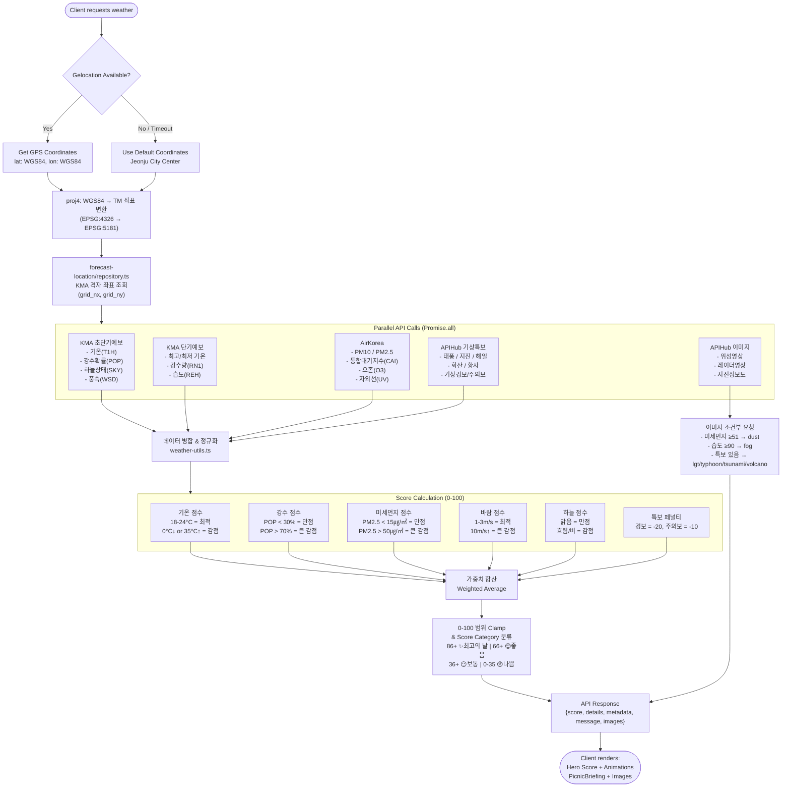

---

## 7. AI Chat Flow — Sequence Diagram (Dashboard & Lab)

```mermaid
sequenceDiagram
    actor User
    participant Client as React Component
    participant API as /api/chat or /api/lab/ai-chat
    participant Session as auth/session.ts
    participant Quota as llm/quota.ts
    participant Memory as chat/repository.ts
    participant Prompt as chat/prompt.ts
    participant LLM as NanoGPT / FactChat
    participant Tavily as Tavily API (Lab only)
    participant DB as TiDB

    User->>Client: Type message &amp; send
    Client->>API: POST /api/chat { sessionId?, message, locale }

    API->>Session: Validate session cookie
    Session-->>API: userId

    API->>Quota: reserveGlobalLlmDailyRequest(limit=5000)
    Quota->>DB: UPSERT + SELECT FOR UPDATE → atomic increment
    alt Global quota exhausted
        Quota-->>API: { allowed: false }
        API-->>Client: 429 "Daily LLM limit reached"
    end

    API->>Quota: reserveUserActionDailyRequest(userId, "chat_message", limit=200)
    Quota->>DB: UPSERT + SELECT FOR UPDATE on (date, userId, quota_key)
    alt User quota exhausted
        Quota-->>API: { allowed: false }
        API-->>Client: 429 "Your daily chat limit reached (200/day)"
    end

    Quota-->>API: { allowed: true, usage }

    API->>DB: Lookup/Create session
    API->>DB: Fetch recent messages (last N, context window limits)
    API->>DB: Fetch cross-session memory (user_chat_memory)

    API->>Prompt: Build system prompt
    Prompt->>Prompt: Inject weather context + score + outdoor recommendations
    Prompt->>Prompt: Inject user memory summary + profile assessment
    Prompt->>Prompt: Apply locale-specific instructions
    Prompt-->>API: System prompt + message history

    opt Lab AI Chat with Web Search
        API->>Tavily: Search(query, topic, timeRange)
        Tavily-->>API: Search results
        API->>DB: Cache results in lab_ai_chat_web_search_state
        API->>Prompt: Inject search results into system prompt
    end

    API->>LLM: POST /chat/completions (SSE stream)
    Note over API,LLM: SSE Streaming<br/>Content-Type: text/event-stream

    loop SSE Events
        LLM-->>API: data: {"choices":[{"delta":{"content":"..."}}]}
        API-->>Client: data: {"content":"...", "done":false}
        Client->>Client: Append token to chat UI
    end

    LLM-->>API: data: [DONE]

    API->>DB: INSERT user message (role=user)
    API->>DB: INSERT assistant message (role=assistant, with token counts)
    API->>Quota: recordGlobalLlmRequestOutcome(success=true)
    API->>DB: INSERT request event log

    API->>Memory: Check if memory compaction needed
    alt Context exceeds threshold (e.g., messages > 50)
        API->>LLM: Generate conversation summary
        LLM-->>API: Summary text
        API->>DB: UPDATE session.memory_summary_text
        API->>DB: Update user_chat_memory (cross-session)
    end

    API-->>Client: data: { done: true, usage: {...} }
    Client-->>User: Display complete response
```

---

## 8. Code Share Collaboration — Sequence & State Diagram

### 8.1 Collaboration Sequence

```mermaid
sequenceDiagram
    actor UserA as User A (Owner)
    actor UserB as User B (Guest)
    participant WSA as WebSocket A
    participant WSB as WebSocket B
    participant WS_Server as WebSocket Server
    participant API as /api/code-share
    participant DB as TiDB

    Note over UserA,DB: ======= SESSION SETUP =======

    UserA->>API: POST /api/code-share/sessions {title, language, code}
    API->>DB: INSERT code_share_sessions (sessionId, version=1)
    DB-->>API: session
    API-->>UserA: { sessionId: "abc123...", version: 1 }

    UserA->>WSA: Connect WebSocket /ws
    WSA->>WS_Server: { type: "code_share_subscribe", sessionId }
    WS_Server->>WS_Server: validateOrigin() → pass
    WS_Server->>WS_Server: authenticateWs() → userA (optional)
    WS_Server->>DB: getCodeShareSessionById()
    WS_Server->>WS_Server: joinRoom(ws, "code_share:abc123")
    WS_Server->>WS_Server: joinCodeSharePresence(sessionId, actorId, alias)
    WS_Server-->>WSA: { type: "code_share_presence", count: 1, participants: [{alias: "UserA", typing: false}] }

    Note over UserA,DB: ======= USER B JOINS =======

    UserB->>WSB: Open URL /code-share/abc123
    WSB->>WS_Server: { type: "code_share_subscribe", sessionId }
    WS_Server->>DB: getCodeShareSessionById("abc123")
    DB-->>WS_Server: session → version=1, code_text
    WS_Server->>WS_Server: joinRoom(wsB, "code_share:abc123")
    WS_Server->>WS_Server: joinCodeSharePresence(sessionId, "guest-xxxx", "Guest-xxxx")
    WS_Server-->>WSB: { type: "code_share_presence", count: 2, participants: [...] }
    WS_Server-->>WSA: { type: "code_share_presence", count: 2, participants: [...] }

    Note over UserA,DB: ======= REAL-TIME EDIT =======

    UserA->>API: PATCH /api/code-share/sessions/abc123 {code, version: 1}
    API->>DB: UPDATE ... WHERE version = 1 → version 2

    par Optimistic Update Success
        DB-->>API: Rows affected: 1
        API-->>UserA: 200 { version: 2 }
        UserA->>WSA: { type: "code_share_saved", sessionId, version: 2 }
        WSA->>WS_Server: Broadcast to room
        WS_Server-->>WSB: { type: "code_share_saved", version: 2, actor: {alias: "UserA"} }
        WSB->>UserB: Silent refresh editor content
    and Version Conflict
        UserB->>API: PATCH /api/code-share/sessions/abc123 {code, version: 1}
        API->>DB: UPDATE ... WHERE version = 1 → FAILS (current version = 2)
        DB-->>API: Rows affected: 0
        API-->>UserB: 409 Conflict { currentVersion: 2 }
        UserB->>UserB: Reload latest version &amp; reapply edits
    end

    Note over UserA,DB: ======= TYPING INDICATORS =======

    UserA->>WSA: { type: "code_share_typing", sessionId, isTyping: true }
    WSA->>WS_Server: Route to presence manager
    WS_Server->>WS_Server: setCodeShareTyping(sessionId, actorA, true)
    WS_Server->>WS_Server: Start 7.5s auto-clear timeout
    WS_Server-->>WSB: { type: "code_share_presence", participants: [{alias: "UserA", typing: true}, ...] }
    WSB-->>UserB: "UserA is typing..."

    Note over UserA,DB: ======= DISCONNECT =======

    UserB->>WSB: Close tab / disconnect
    WSB->>WS_Server: ws.on("close")
    WS_Server->>WS_Server: leaveCodeSharePresence(sessionId, actorB)
    WS_Server->>WS_Server: leaveRoom(wsB, room)
    WS_Server->>WS_Server: removeClient(wsB)
    WS_Server-->>WSA: { type: "code_share_presence", count: 1, participants: [{typing: true}] }
    WSA-->>UserA: "User B disconnected"
```

### 8.2 WebSocket Connection Lifecycle — State Machine

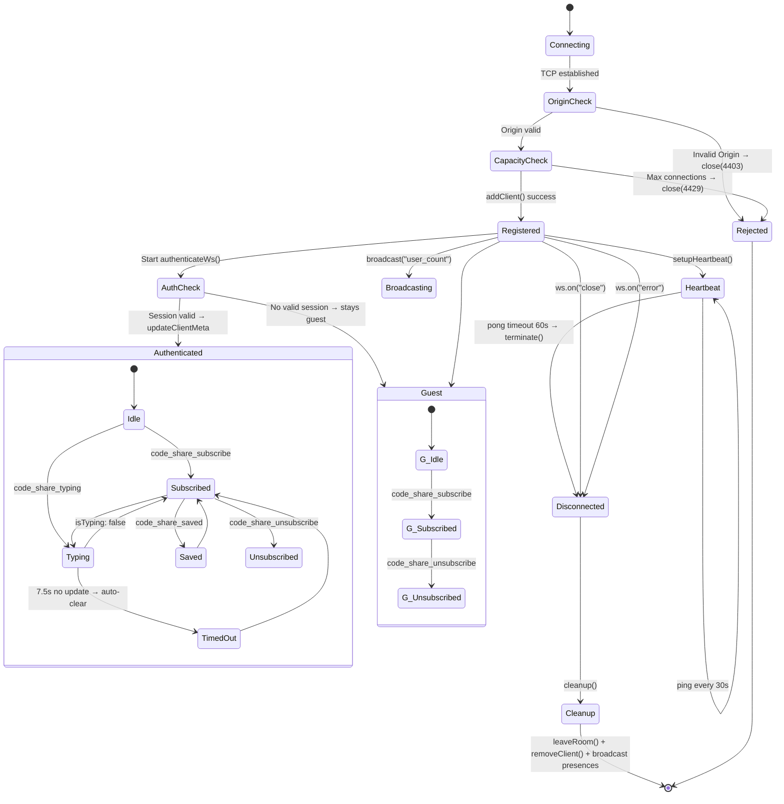

---

## 9. FSRS Spaced Repetition — Card State Machine

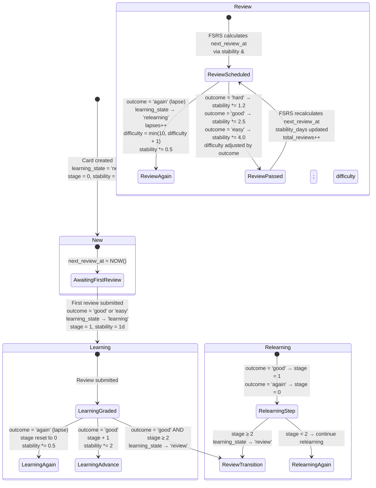

---

## 10. Dependency Graph — Package-Level Module Dependencies

```mermaid
graph LR
    subgraph "Frontend (Browser)"
        PAGES["app/ (Pages)"]
        COMPONENTS["components/"]
        CONTEXT["context/<br/>Auth / Language"]
        SERVICES["services/<br/>dataService.ts"]
    end

    subgraph "Backend Logic"
        AUTH_LIB["lib/auth/<br/>10 files"]
        CHAT_LIB["lib/chat/<br/>7 files"]
        LAB_LIB["lib/lab/<br/>7 files (FSRS)"]
        LAB_AI_LIB["lib/lab-ai-chat/<br/>6 files"]
        CODE_SHARE_LIB["lib/code-share/<br/>5 files"]
        WS_LIB["lib/websocket/<br/>3 files"]
        LLM_QUOTA["lib/llm/<br/>quota.ts"]
        ANALYTICS_LIB["lib/analytics/<br/>4 files"]
    end

    subgraph "Infrastructure"
        DB_LIB["lib/db.ts<br/>MySQL2 Pool"]
        SECURITY_LIB["lib/security/<br/>data-protection.ts<br/>AES-256-GCM + HKDF"]
        NANOGPT["lib/nanogpt/<br/>client.ts<br/>OpenAI-compatible"]
        TAVILY_LIB["lib/tavily/<br/>client.ts"]
        WEATHER_UTILS["lib/weather-utils.ts<br/>lib/coords-utils.ts"]
        FORECAST_GRID["lib/forecast-location/<br/>KMA Grid DB"]
    end

    PAGES --> COMPONENTS
    PAGES --> CONTEXT
    COMPONENTS --> CONTEXT
    COMPONENTS --> SERVICES

    AUTH_LIB --> DB_LIB
    AUTH_LIB --> SECURITY_LIB
    CHAT_LIB --> DB_LIB
    CHAT_LIB --> AUTH_LIB
    CHAT_LIB --> NANOGPT
    CHAT_LIB --> LLM_QUOTA
    LAB_LIB --> DB_LIB
    LAB_LIB --> LLM_QUOTA
    LAB_AI_LIB --> DB_LIB
    LAB_AI_LIB --> TAVILY_LIB
    LAB_AI_LIB --> LLM_QUOTA
    CODE_SHARE_LIB --> DB_LIB
    CODE_SHARE_LIB --> AUTH_LIB
    WS_LIB --> AUTH_LIB
    WS_LIB --> CODE_SHARE_LIB
    ANALYTICS_LIB --> DB_LIB

    SECURITY_LIB --> DB_LIB
    LLM_QUOTA --> DB_LIB

    SERVICES -->|fetch()| PAGES
    CONTEXT -->|fetch()| PAGES
```

---

## 11. API Route Map — All Endpoints

```mermaid
mindmap
  root((API Routes<br/>50+ Endpoints))
    Auth /api/auth
      POST register
      POST login
      GET me
      POST logout
      GET profile
      PUT profile
      DELETE account
    Weather /api/weather
      GET current (1391 lines)
      GET forecast
      GET images
      GET images/asset
      GET archives
      GET trends
      GET insights
      POST recommendations/generate
    Fire /api/fire
      GET summary
    Chat /api/chat
      GET (state)
      POST (SSE stream)
      sessions
        GET (list)
        POST (create)
        DELETE [id]
    Lab /api/lab
      decks
        GET (list)
        POST (create)
      cards
        GET (list)
        POST (create)
        POST autofill
      POST generate (AI deck)
      POST review (single)
      POST review/batch (up to 50)
      GET report
      POST import
      GET export
      GET template
      GET state
    Lab AI Chat /api/lab/ai-chat
      POST (SSE stream)
      sessions
        GET (list)
        POST (create)
    Code Share /api/code-share
      sessions
        GET (list)
        POST (create)
        GET [sessionId]
        PATCH [sessionId] (optimistic)
        DELETE [sessionId]
    Jeonju /api/jeonju
      GET briefing
    Jeonju Chat /api/jeonju-chat
      GET (list)
      POST (send)
    Analytics /api/analytics
      POST page-view
      POST consent
```

---

## 12. Rate Limiting & Quota Architecture

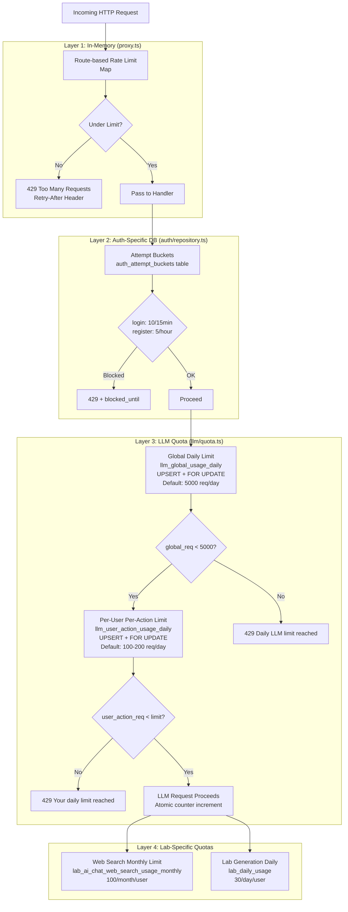

---

## 13. Data Encryption Architecture

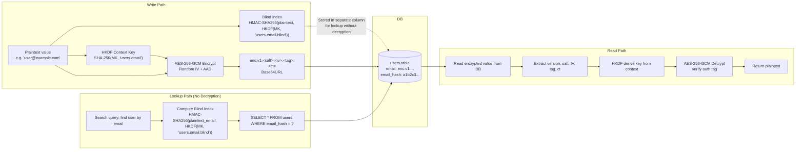

---

## 14. Deployment Architecture (Production)

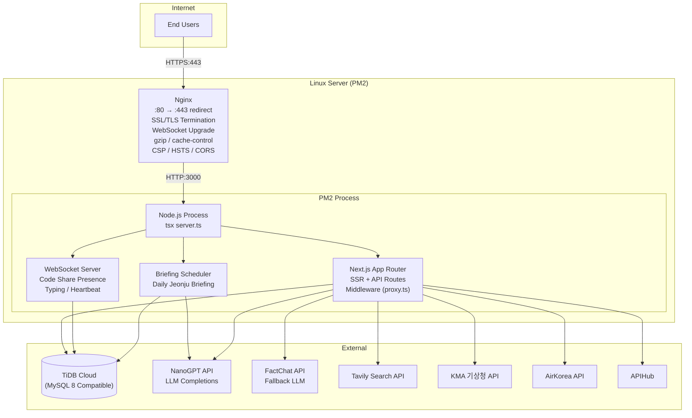

---

## 15. i18n Architecture

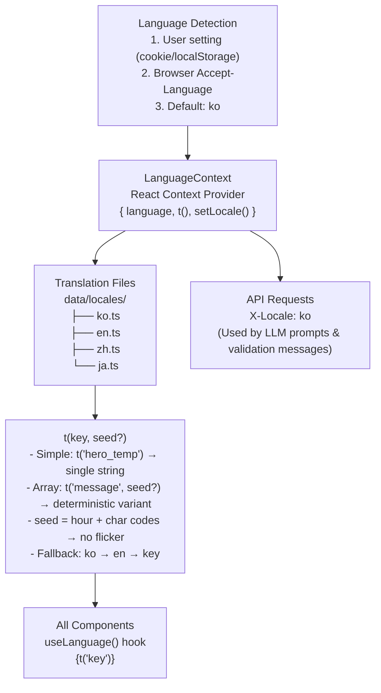

---

## 16. Performance Optimization — Device Tier Detection

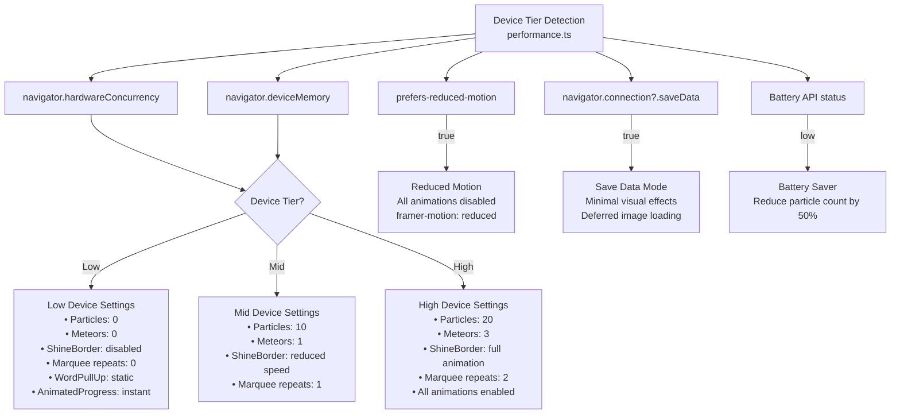

---

## 17. Jeonju Briefing Scheduler — Timer-Based Generation

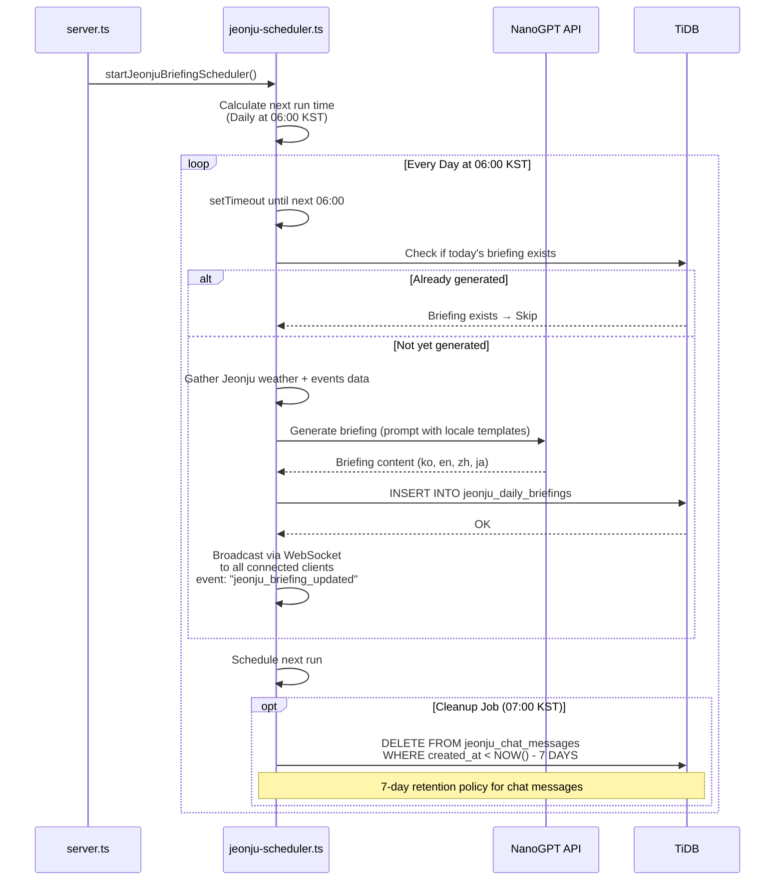

---

## 요약 (Summary)

| 계층 | 핵심 기술 | 담당 모듈 |
|------|-----------|-----------|
| **프론트엔드** | React 19, Next.js 16 App Router, TailwindCSS 4, Framer Motion, CodeMirror 6 | `src/app/`, `src/components/`, `src/context/` |
| **보안** | AES-256-GCM (Field-level Encryption), scrypt(N=16384) + Pepper, HKDF, HMAC Blind Index | `src/lib/security/`, `src/lib/auth/` |
| **인증** | Cookie-based Session (7d TTL), SHA-256 Token Hash, In-Memory LRU Cache | `src/lib/auth/session.ts`, `src/lib/auth/repository.ts` |
| **DB** | TiDB / MySQL 8, mysql2/promise, 20 Tables | `src/lib/db.ts`, 각 도메인 `schema.ts` |
| **AI** | NanoGPT (Primary) + FactChat (Fallback), SSE Streaming, Prompt Injection with Weather Context | `src/lib/chat/`, `src/lib/nanogpt/`, `src/lib/lab-ai-chat/` |
| **Rate Limit** | 3-Layer: In-Memory (proxy.ts) → DB Attempt Buckets → LLM Quota (FOR UPDATE) | `src/proxy.ts`, `src/lib/llm/quota.ts`, `src/lib/auth/repository.ts` |
| **WebSocket** | ws library, Room-based Pub/Sub, Presence Tracking, Heartbeat, Typing Indicators | `src/lib/websocket/` |
| **Spaced Repetition** | FSRS v5 Algorithm (stability, difficulty, state machine) | `src/lib/lab/` |
| **Search** | Tavily API, Cached Results, Monthly Quota | `src/lib/tavily/`, `src/lib/lab-ai-chat/` |
| **i18n** | 4 Languages (ko/en/zh/ja), Deterministic Array Variable Selection | `src/context/LanguageContext.tsx`, `src/data/locales/` |
| **Analytics** | Privacy-First, Consent-Gated, Multi-Dimensional Metrics | `src/lib/analytics/` |
| **Deploy** | PM2 + Nginx, Single Node.js Process (HTTP + WS), TiDB Cloud | `server.ts`, Nginx config |
