# Nadeulhae — Architecture & UML Documentation

> **Version**: 0.1.0 | **Framework**: Next.js 16.2.4 (App Router) | **Language**: TypeScript 6.0

---

## 1. Project Overview

**Nadeulhae** (a portmanteau of "Nadeuri" meaning outing + "Hae" meaning sun/sea) is a **weather-based outdoor activity scoring service + AI Chat + code sharing platform**. Centered on Jeonju city, it combines real-time data from KMA, AirKorea, and APIHub to compute a 0-100 picnic score, along with OpenAI-compatible LLM-based AI chat, FSRS-algorithm vocabulary learning (Lab), and a WebSocket-based real-time collaborative code editor.

---

## 2. System Architecture — Deployment Diagram

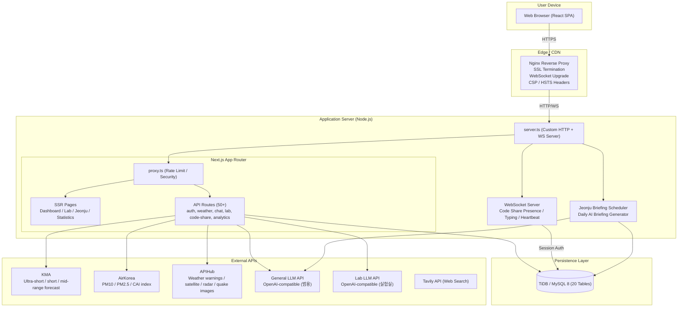

---

## 3. Frontend Component Hierarchy — Component Tree

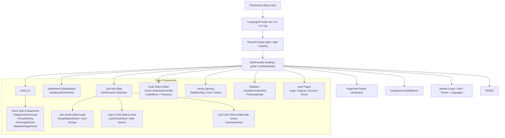

---

## 4. Database Schema — Entity-Relationship Diagram (ERD)

> **Encryption Legend**: [E] = AES-256-GCM encrypted field | [BI] = Blind Index (HMAC-SHA256) | [IDX] = Indexed column

```mermaid
erDiagram
    users {
        string id PK "UUIDv4"
        string email "AES-256-GCM encrypted [E]"
        string email_hash "HMAC-SHA256 Blind Index [BI] [IDX] UNIQUE"
        string display_name "Encrypted [E]"
        string nickname "Encrypted [E]"
        string nickname_hash "Blind Index [BI] [IDX] UNIQUE with tag"
        string nickname_tag "Random 4-digit tag"
        string password_hash "scrypt(N equals 16384)"
        string password_salt "scrypt salt"
        string password_algo "always scrypt-v1"
        string age_band "Encrypted [E]"
        string primary_region "Encrypted [E]"
        string interest_tags "JSON array encrypted [E]"
        string interest_other "Encrypted [E]"
        string preferred_time_slot "Encrypted [E]"
        string weather_sensitivity "JSON array encrypted [E]"
        datetime terms_agreed_at
        datetime privacy_agreed_at
        datetime age_confirmed_at
        boolean marketing_accepted
        boolean analytics_accepted
        boolean lab_enabled "Lab feature toggle"
        datetime created_at
        datetime updated_at
    }

    user_sessions {
        string id PK "UUIDv4"
        string user_id FK "Reference users.id"
        string token_hash "SHA-256 of session token [IDX] UNIQUE"
        datetime expires_at "Indexed [IDX]"
        string user_agent "Encrypted [E]"
        string ip_address "Encrypted [E]"
        datetime created_at
        datetime last_used_at
    }

    auth_attempt_buckets {
        int id PK "AUTO_INCREMENT"
        string action "login or register"
        string scope_key "IP or email_hash"
        int attempt_count
        datetime window_started_at
        datetime blocked_until "Indexed [IDX]"
        datetime last_attempt_at
        string uniqueKey "UNIQUE on action plus scope_key"
    }

    auth_security_events {
        int id PK "AUTO_INCREMENT"
        string event_type
        string action
        string outcome "success or failure"
        string user_id FK "Indexed [IDX]"
        string email "Encrypted [E]"
        string email_hash "Blind Index [BI] [IDX]"
        string ip_address "Encrypted [E]"
        string user_agent "Encrypted [E]"
        string metadata "JSON"
        datetime created_at "Indexed [IDX]"
    }

    user_chat_sessions {
        int id PK "AUTO_INCREMENT"
        string user_id FK "Indexed [IDX]"
        string title
        string locale "ko or en or zh or ja"
        boolean is_auto_title
        string memory_summary_text "Encrypted [E]"
        int memory_token_estimate
        int summarized_message_count
        string memory_model_used
        datetime last_compacted_at
        datetime last_message_at "Indexed [IDX]"
        datetime created_at "Indexed [IDX]"
        datetime updated_at "Indexed [IDX]"
    }

    user_chat_messages {
        int id PK "AUTO_INCREMENT"
        string user_id FK "Indexed [IDX]"
        int session_id FK "Indexed [IDX]"
        string role "user or assistant or system"
        string locale
        string content "AES-256-GCM encrypted [E]"
        string provider_message_id
        string requested_model
        string resolved_model
        int prompt_tokens
        int completion_tokens
        int total_tokens
        int cached_prompt_tokens
        datetime included_in_memory_at "Indexed [IDX]"
        datetime created_at "Indexed [IDX]"
    }

    user_chat_memory {
        string user_id PK "FK to users"
        string summary_text "Cross-session memory [E]"
        string assessment_text "User profile assessment [E]"
        int summary_token_estimate
        int summarized_message_count
        int last_profile_message_id
        string model_used
        string profile_model_used
        datetime last_compacted_at
        datetime profile_refreshed_at
        datetime updated_at
    }

    user_chat_usage_daily {
        date metric_date PK
        string user_id PK "Indexed [IDX]"
        int request_count
        int success_count
        int failure_count
        bigint prompt_tokens
        bigint completion_tokens
        bigint total_tokens
        bigint cached_prompt_tokens
        datetime last_used_at "Indexed [IDX]"
    }

    user_chat_request_events {
        int id PK "AUTO_INCREMENT"
        string user_id FK "Indexed [IDX]"
        int session_id FK "Indexed [IDX]"
        string request_kind "Indexed [IDX]"
        string status "Indexed [IDX]"
        string locale
        string requested_model
        string resolved_model
        string provider_request_id
        int message_count
        int input_characters
        int output_characters
        int prompt_tokens
        int completion_tokens
        int total_tokens
        int cached_prompt_tokens
        int latency_ms
        string error_code
        string error_message
        datetime created_at "Indexed [IDX]"
    }

    lab_decks {
        int id PK "AUTO_INCREMENT"
        string user_id FK "Indexed [IDX]"
        string locale
        string title_text
        string topic_text
        string requested_model
        string resolved_model
        int card_count
        datetime created_at "Indexed [IDX]"
        datetime updated_at
    }

    lab_cards {
        int id PK "AUTO_INCREMENT"
        int deck_id FK "Indexed [IDX]"
        string user_id FK "Indexed [IDX]"
        string term_text "Vocabulary term"
        string meaning_text "Meaning / translation"
        string example_text "Example sentence"
        string example_translation_text "Example translation"
        string pos_text "Part of speech"
        string tip_text "Tips / notes"
        string learning_state "Indexed [IDX]: new or learning or review or relearning"
        int consecutive_correct
        int stage "FSRS stage (0-8)"
        double stability_days "FSRS stability"
        double difficulty "FSRS difficulty (1-10)"
        int total_reviews
        int lapses
        int last_review_outcome "0 equals again, 1 equals hard, 2 equals good, 3 equals easy"
        datetime next_review_at "Indexed [IDX]: FSRS scheduled review time"
        datetime last_reviewed_at
        datetime created_at
        datetime updated_at
    }

    lab_daily_usage {
        date metric_date PK
        string user_id PK "Indexed [IDX]"
        int generation_count
        int review_count
        datetime created_at
        datetime updated_at
    }

    lab_ai_chat_sessions {
        int id PK "AUTO_INCREMENT"
        string user_id FK "Indexed [IDX]"
        string title_text
        string locale
        string memory_summary_text
        int memory_token_estimate
        int summarized_message_count
        string memory_model_used
        datetime last_compacted_at
        datetime last_message_at "Indexed [IDX]"
        datetime created_at "Indexed [IDX]"
        datetime updated_at "Indexed [IDX]"
    }

    lab_ai_chat_messages {
        int id PK "AUTO_INCREMENT"
        string user_id FK "Indexed [IDX]"
        int session_id FK "Indexed [IDX]"
        string role
        string locale
        string content
        string provider_message_id
        string requested_model
        string resolved_model
        int prompt_tokens
        int completion_tokens
        int total_tokens
        int cached_prompt_tokens
        datetime included_in_memory_at "Indexed [IDX]"
        datetime created_at "Indexed [IDX]"
    }

    lab_ai_chat_web_search_state {
        string user_id PK "Composite PK"
        int session_id PK "Composite PK"
        int session_call_count
        int fallback_call_count
        string cache_query_text
        string cache_result_text
        string cache_topic
        string cache_time_range
        date cache_start_date
        date cache_end_date
        int cache_result_count
        datetime cache_updated_at "Indexed [IDX]"
        datetime created_at
        datetime updated_at "Indexed [IDX]"
    }

    code_share_sessions {
        int id PK "AUTO_INCREMENT"
        string session_id "UNIQUE [IDX], public session token"
        string owner_actor_id "Indexed [IDX]: Guest actor UUID"
        string owner_user_id "Indexed [IDX]: Optional auth user ID"
        string title_text
        string language_code "javascript or python or go etc."
        string code_text "Code content"
        string status "Indexed [IDX]: active or closed"
        int version "Optimistic concurrency"
        datetime last_activity_at "Indexed [IDX]"
        datetime closed_at
        datetime created_at
        datetime updated_at
    }

    llm_global_usage_daily {
        date metric_date PK "Asia/Seoul date"
        int request_count "Atomic counter (FOR UPDATE)"
        int success_count
        int failure_count
        datetime last_used_at "Indexed [IDX]"
    }

    llm_user_action_usage_daily {
        date metric_date PK "Composite PK"
        string user_id PK "Composite PK"
        string quota_key PK "Composite PK, e.g. chat_message"
        int request_count
        int success_count
        int failure_count
        datetime last_used_at "Indexed [IDX]"
    }

    analytics_daily_route_metrics {
        date metric_date PK
        string dimension_key PK "SHA-256 hash of all dimensions"
        string route_kind "Indexed [IDX]: page or api"
        string route_path "Indexed [IDX]"
        string method "GET or POST or PUT or DELETE"
        int status_code
        string status_group "2xx or 3xx or 4xx or 5xx"
        string auth_state
        string device_type
        string locale
        bigint request_count
        bigint unique_visitors
        bigint unique_users
        bigint total_duration_ms
        int peak_duration_ms
        datetime first_seen_at
        datetime last_seen_at "Indexed [IDX]"
    }

    analytics_daily_unique_entities {
        date metric_date PK
        string dimension_key PK "Composite PK"
        string entity_type PK "Composite PK"
        string entity_hash PK "SHA-256, Composite PK"
    }

    analytics_daily_actor_activity {
        date metric_date PK
        string actor_key PK
        string actor_type "visitor or user"
        string user_id FK "Indexed [IDX]"
        string auth_state
        string device_type
        string locale
        bigint page_view_count
        bigint api_request_count
        bigint mutation_count
        bigint error_count
        datetime first_seen_at
        datetime last_seen_at "Indexed [IDX]"
    }

    analytics_daily_page_context_metrics {
        date metric_date PK
        string dimension_key PK
        string route_path "Indexed [IDX]"
        string auth_state
        string device_type
        string locale
        string theme "dark, light, system"
        string viewport_bucket
        string time_zone
        string referrer_host
        string acquisition_channel "Indexed [IDX]"
        string utm_source
        string utm_medium
        string utm_campaign
        bigint page_view_count
        bigint unique_visitors
        bigint unique_users
        bigint total_load_ms
        int peak_load_ms
        datetime first_seen_at
        datetime last_seen_at "Indexed [IDX]"
    }

    analytics_daily_consent_metrics {
        date metric_date PK
        string dimension_key PK
        string decision_source "Indexed [IDX]: banner or settings"
        string consent_state "Indexed [IDX]: accepted or rejected"
        string auth_state
        string device_type
        string locale
        bigint decision_count
        bigint unique_visitors
        bigint unique_users
        datetime first_seen_at
        datetime last_seen_at "Indexed [IDX]"
    }

    jeonju_daily_briefings {
        int id PK "AUTO_INCREMENT"
        date briefing_date "UNIQUE"
        string content "Multi-locale briefing"
        string model_used
        datetime generated_at
        datetime created_at
    }

    jeonju_chat_messages {
        int id PK "AUTO_INCREMENT"
        string visitor_id "Indexed [IDX]"
        string user_id "Indexed [IDX]"
        string role "user or assistant"
        string content
        datetime created_at "Indexed [IDX]"
    }

    users ||--o{ user_sessions : has
    users ||--o{ user_chat_sessions : owns
    users ||--o{ user_chat_messages : sends
    users ||--|| user_chat_memory : has
    users ||--o{ lab_decks : owns
    users ||--o{ lab_cards : owns
    users ||--o{ lab_ai_chat_sessions : owns
    users ||--o{ lab_ai_chat_messages : sends
    users ||--o{ llm_user_action_usage_daily : consumes
    users ||--o{ analytics_daily_actor_activity : generates
    users ||--o{ code_share_sessions : creates
    users ||--o{ jeonju_chat_messages : writes
    
    user_chat_sessions ||--o{ user_chat_messages : contains
    user_chat_sessions ||--o{ user_chat_request_events : tracks
    lab_decks ||--o{ lab_cards : contains
    lab_ai_chat_sessions ||--o{ lab_ai_chat_messages : contains
    lab_ai_chat_sessions ||--|| lab_ai_chat_web_search_state : has
```

---

## 5. Authentication Flow — Sequence Diagram

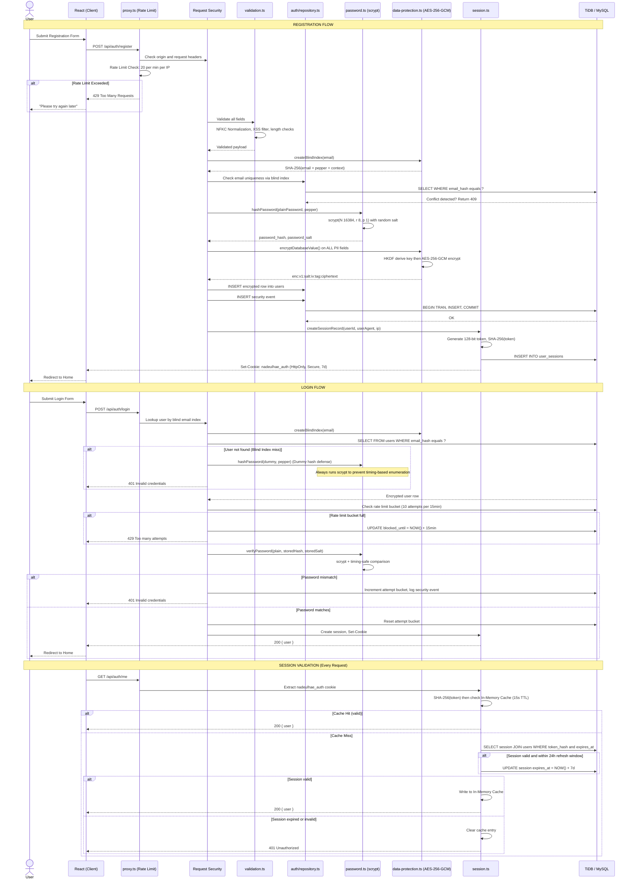

---

## 6. Weather Score Pipeline — Activity Diagram

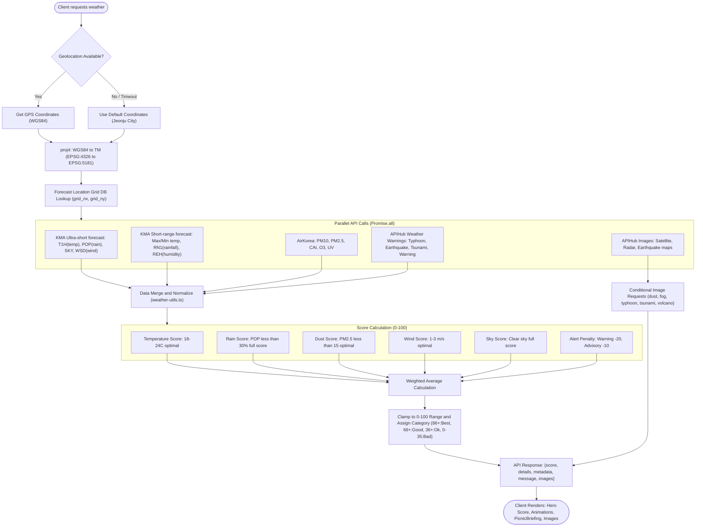

---

## 7. AI Chat Flow — Sequence Diagram

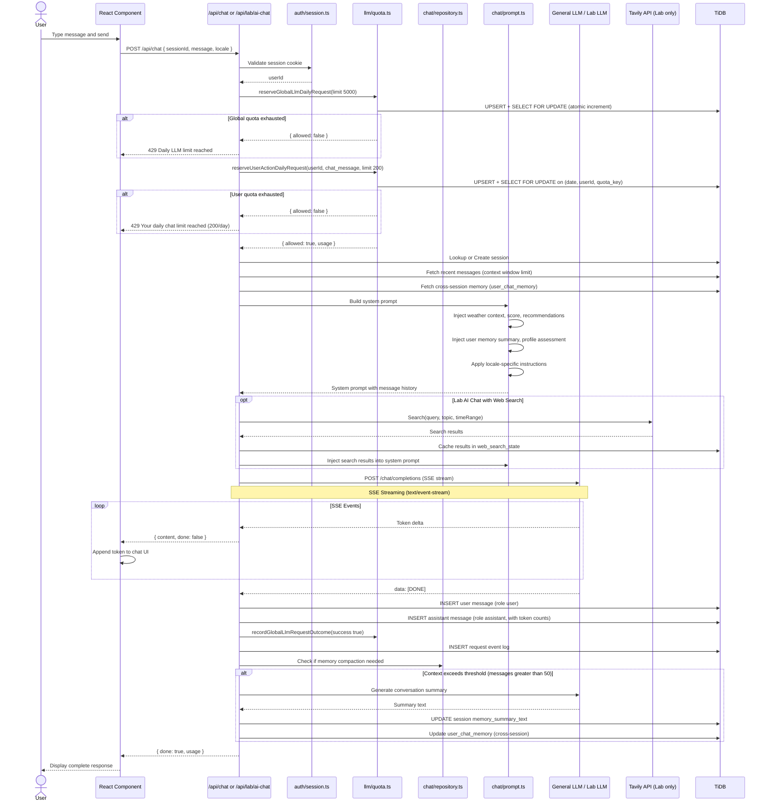

---

## 8. Code Share Collaboration — Sequence & State Diagram

### 8.1 Collaboration Sequence

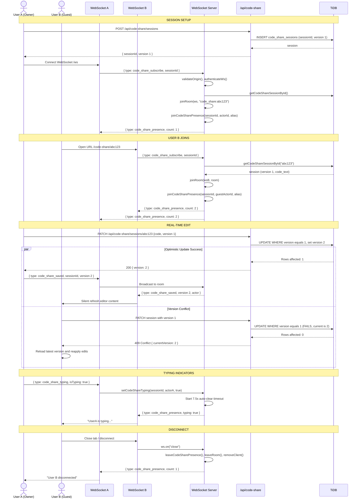

### 8.2 WebSocket Connection Lifecycle — State Machine

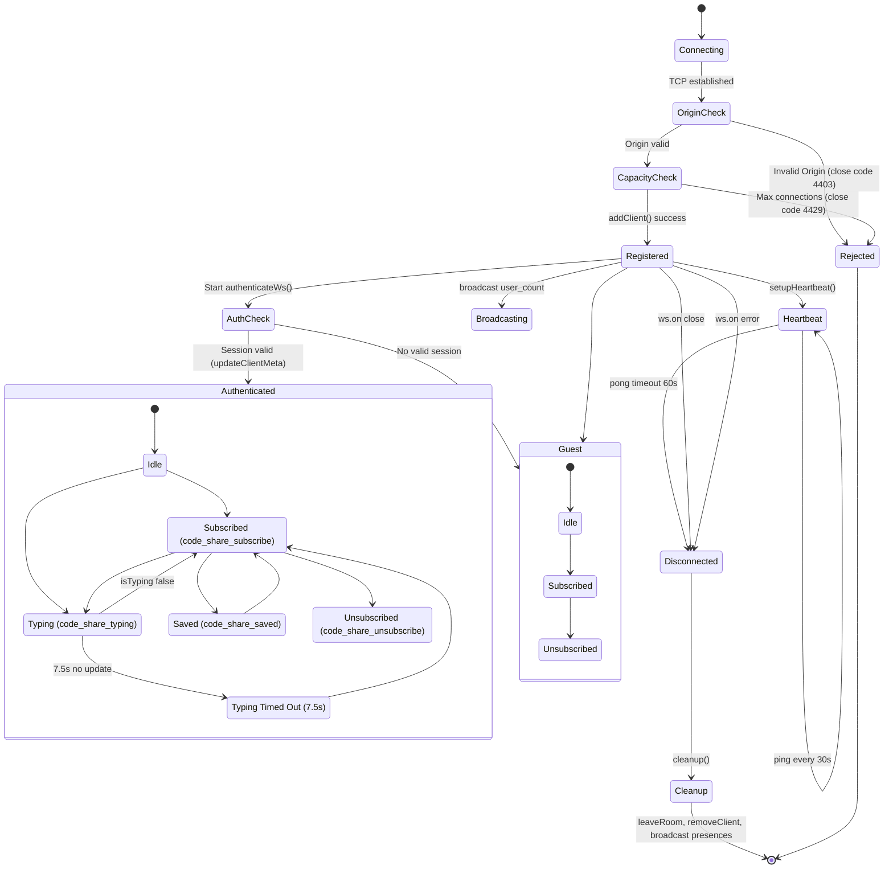

---

## 9. FSRS Spaced Repetition — Card State Machine

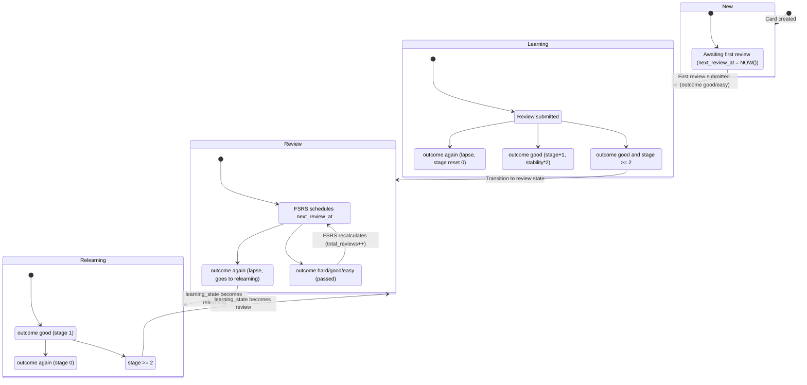

---

## 10. Dependency Graph — Package-Level Module Dependencies

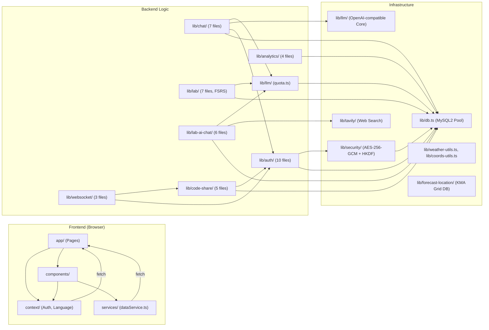

---

## 11. API Route Map — All Endpoints

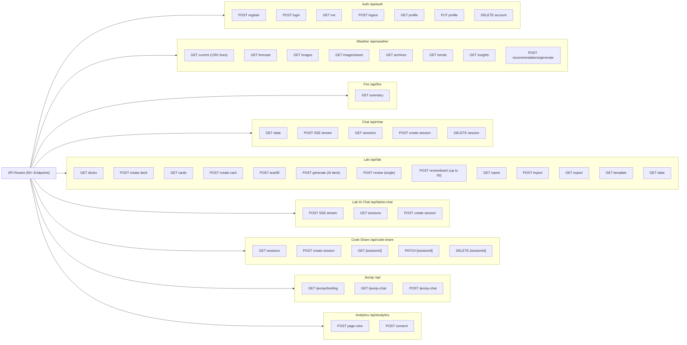

---

## 12. Rate Limiting & Quota Architecture

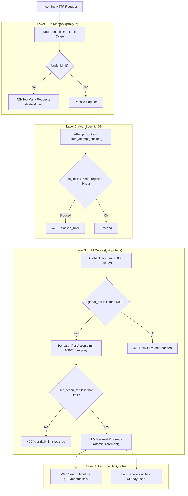

---

## 13. Data Encryption Architecture

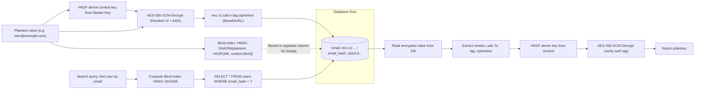

---

## 14. Deployment Architecture (Production)

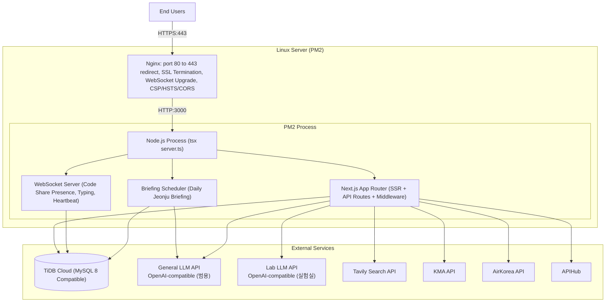

---

## 15. i18n Architecture

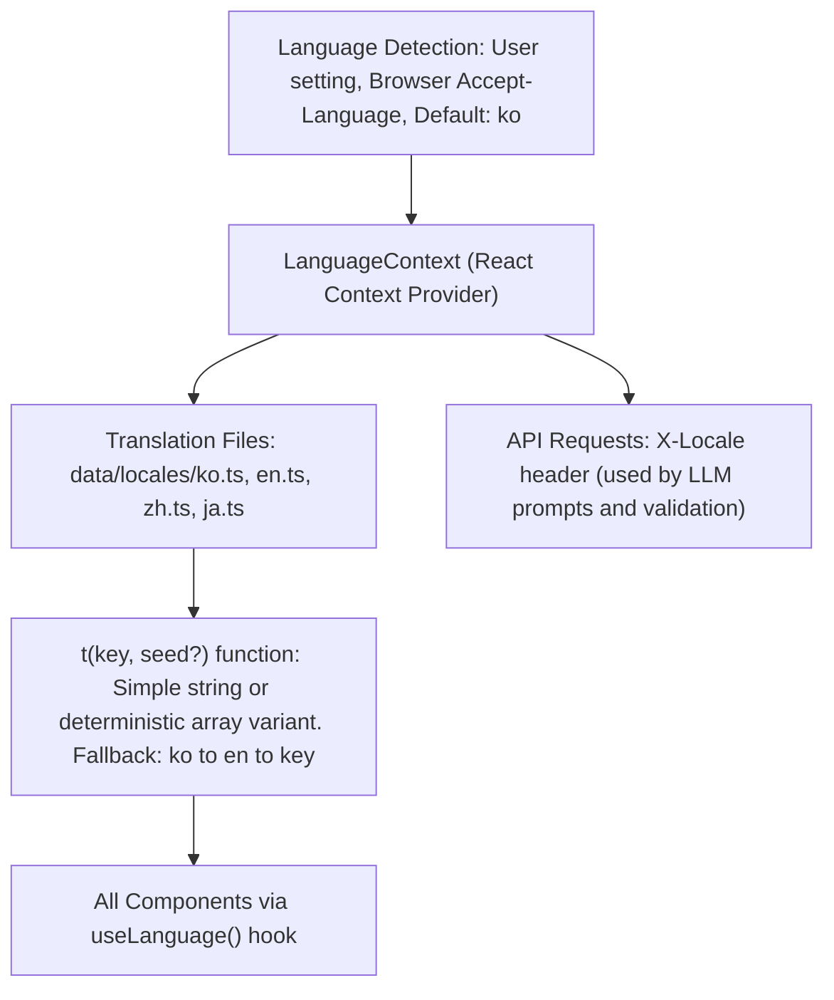

---

## 16. Performance Optimization — Device Tier Detection

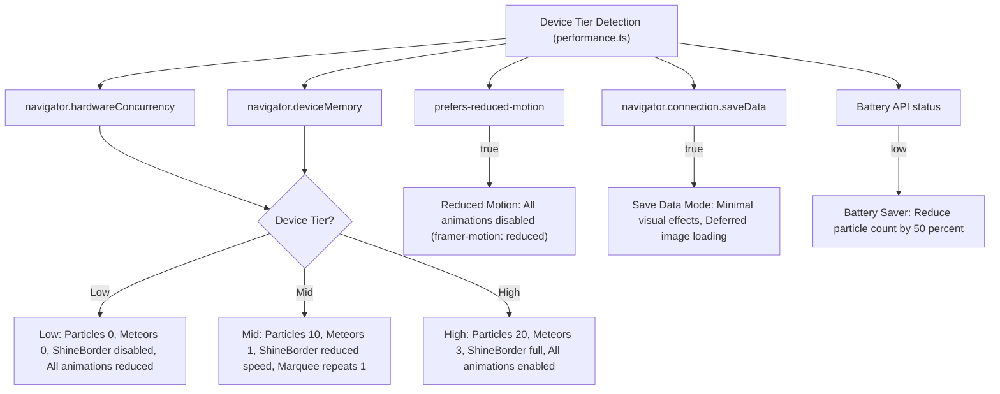

---

## 17. Jeonju Briefing Scheduler — Timer-Based Generation

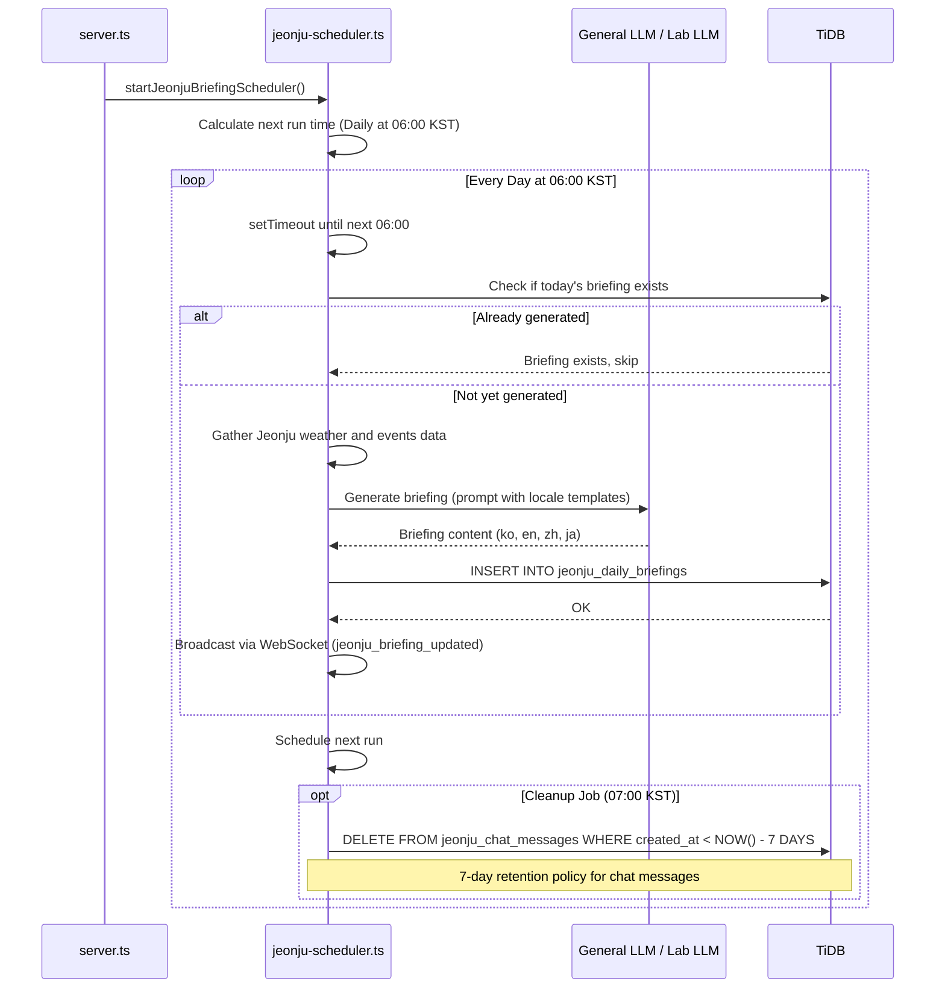

---

## Summary

| Layer | Core Technology | Module |
|-------|----------------|--------|
| **Frontend** | React 19, Next.js 16 App Router, TailwindCSS 4, Framer Motion, CodeMirror 6 | `src/app/`, `src/components/`, `src/context/` |
| **Security** | AES-256-GCM (Field-level Encryption), scrypt(N=16384) + Pepper, HKDF, HMAC Blind Index | `src/lib/security/`, `src/lib/auth/` |
| **Auth** | Cookie-based Session (7d TTL), SHA-256 Token Hash, In-Memory LRU Cache | `src/lib/auth/session.ts`, `src/lib/auth/repository.ts` |
| **Database** | TiDB / MySQL 8, mysql2/promise, 20 Tables | `src/lib/db.ts`, domain `schema.ts` files |
| **AI** | OpenAI-compatible LLM (General + Lab), SSE Streaming, Prompt Injection with Weather Context | `src/lib/llm/`, `src/lib/chat/`, `src/lib/lab-ai-chat/` |
| **Rate Limit** | 3-Layer: In-Memory (proxy.ts), DB Attempt Buckets, LLM Quota (FOR UPDATE) | `src/proxy.ts`, `src/lib/llm/quota.ts`, `src/lib/auth/repository.ts` |
| **WebSocket** | ws library, Room-based Pub/Sub, Presence Tracking, Heartbeat, Typing Indicators | `src/lib/websocket/` |
| **Spaced Repetition** | FSRS v5 Algorithm (stability, difficulty, state machine) | `src/lib/lab/` |
| **Search** | Tavily API, Cached Results, Monthly Quota | `src/lib/tavily/`, `src/lib/lab-ai-chat/` |
| **i18n** | 4 Languages (ko/en/zh/ja), Deterministic Array Variant Selection | `src/context/LanguageContext.tsx`, `src/data/locales/` |
| **Analytics** | Privacy-First, Consent-Gated, Multi-Dimensional Metrics | `src/lib/analytics/` |
| **Deploy** | PM2 + Nginx, Single Node.js Process (HTTP + WS), TiDB Cloud | `server.ts`, Nginx config |
