# 나들해 (Nadeulhae) — 아키텍처 UML 문서 (한국어판)

> **버전**: 0.1.0 | **프레임워크**: Next.js 16.2.4 (App Router) | **언어**: TypeScript 6.0

---

## 1. 프로젝트 개요

**나들해**("나들이" + "해")는 **날씨 기반 야외활동 점수 서비스 + AI 채팅 + 코드 공유 플랫폼**이다. 전주시를 중심으로 기상청(KMA), 한국환경공단(AirKorea), APIHub의 실시간 데이터를 결합해 0~100점의 피크닉 지수를 산출하고, OpenAI 호환 LLM 기반의 AI 채팅, FSRS 알고리즘을 활용한 어휘 암기(랩), 그리고 WebSocket 기반 실시간 협업 코드 에디터를 제공한다.

---

## 2. 시스템 아키텍처 — 배포 구성도

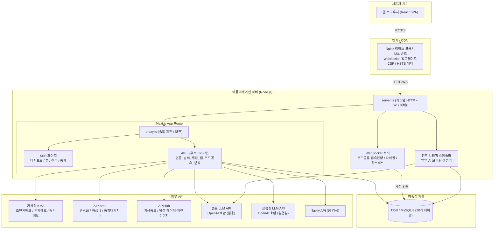

---

## 3. 프론트엔드 컴포넌트 계층 구조

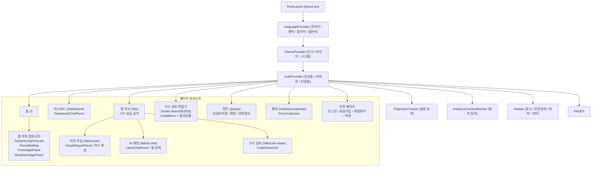

---

## 4. 데이터베이스 스키마 — Entity-Relationship Diagram (ERD)

> **암호화 범례**: [E] = AES-256-GCM 암호화 필드 | [BI] = 블라인드 인덱스 (HMAC-SHA256) | [IDX] = 인덱스 컬럼

```mermaid
erDiagram
    users {
        string id PK "UUIDv4"
        string email "AES-256-GCM 암호화 [E]"
        string email_hash "HMAC-SHA256 블라인드 인덱스 [BI] [IDX] UNIQUE"
        string display_name "암호화 [E]"
        string nickname "암호화 [E]"
        string nickname_hash "블라인드 인덱스 [BI] [IDX] 태그와 함께 UNIQUE"
        string nickname_tag "랜덤 4자리 태그"
        string password_hash "scrypt(N=16384)"
        string password_salt "scrypt 솔트"
        string password_algo "항상 scrypt-v1"
        string age_band "암호화 [E]"
        string primary_region "암호화 [E]"
        string interest_tags "JSON 배열 암호화 [E]"
        string interest_other "암호화 [E]"
        string preferred_time_slot "암호화 [E]"
        string weather_sensitivity "JSON 배열 암호화 [E]"
        datetime terms_agreed_at "약관 동의 일시"
        datetime privacy_agreed_at "개인정보 동의 일시"
        datetime age_confirmed_at "연령 확인 일시"
        boolean marketing_accepted "마케팅 동의"
        boolean analytics_accepted "분석 동의"
        boolean lab_enabled "랩 기능 활성화 여부"
        datetime created_at "생성일시"
        datetime updated_at "수정일시"
    }

    user_sessions {
        string id PK "UUIDv4"
        string user_id FK "users.id 참조"
        string token_hash "세션 토큰 SHA-256 [IDX] UNIQUE"
        datetime expires_at "인덱스 [IDX]"
        string user_agent "암호화 [E]"
        string ip_address "암호화 [E]"
        datetime created_at "생성일시"
        datetime last_used_at "마지막 사용일시"
    }

    auth_attempt_buckets {
        int id PK "AUTO_INCREMENT"
        string action "로그인 또는 회원가입"
        string scope_key "IP 또는 email_hash"
        int attempt_count "시도 횟수"
        datetime window_started_at "제한 윈도우 시작"
        datetime blocked_until "인덱스 [IDX]"
        datetime last_attempt_at "마지막 시도일시"
        string uniqueKey "action + scope_key 쌍 UNIQUE"
    }

    auth_security_events {
        int id PK "AUTO_INCREMENT"
        string event_type "이벤트 유형"
        string action "작업"
        string outcome "성공 또는 실패"
        string user_id FK "인덱스 [IDX]"
        string email "암호화 [E]"
        string email_hash "블라인드 인덱스 [BI] [IDX]"
        string ip_address "암호화 [E]"
        string user_agent "암호화 [E]"
        string metadata "JSON"
        datetime created_at "인덱스 [IDX]"
    }

    user_chat_sessions {
        int id PK "AUTO_INCREMENT"
        string user_id FK "인덱스 [IDX]"
        string title "세션 제목"
        string locale "ko | en | zh | ja"
        boolean is_auto_title "자동 생성 제목 여부"
        string memory_summary_text "암호화 [E]"
        int memory_token_estimate "추정 토큰 수"
        int summarized_message_count "요약된 메시지 수"
        string memory_model_used "사용된 모델명"
        datetime last_compacted_at "마지막 압축일시"
        datetime last_message_at "인덱스 [IDX]"
        datetime created_at "인덱스 [IDX]"
        datetime updated_at "인덱스 [IDX]"
    }

    user_chat_messages {
        int id PK "AUTO_INCREMENT"
        string user_id FK "인덱스 [IDX]"
        int session_id FK "인덱스 [IDX]"
        string role "user | assistant | system"
        string locale
        string content "AES-256-GCM 암호화 [E]"
        string provider_message_id
        string requested_model
        string resolved_model
        int prompt_tokens
        int completion_tokens
        int total_tokens
        int cached_prompt_tokens
        datetime included_in_memory_at "인덱스 [IDX]"
        datetime created_at "인덱스 [IDX]"
    }

    user_chat_memory {
        string user_id PK "users 참조"
        string summary_text "세션간 메모리 [E]"
        string assessment_text "사용자 프로필 평가 [E]"
        int summary_token_estimate
        int summarized_message_count
        int last_profile_message_id
        string model_used
        string profile_model_used
        datetime last_compacted_at
        datetime profile_refreshed_at
        datetime updated_at
    }

    user_chat_usage_daily {
        date metric_date PK "기준일자"
        string user_id PK "인덱스 [IDX]"
        int request_count "요청 수"
        int success_count "성공 수"
        int failure_count "실패 수"
        bigint prompt_tokens
        bigint completion_tokens
        bigint total_tokens
        bigint cached_prompt_tokens
        datetime last_used_at "인덱스 [IDX]"
    }

    user_chat_request_events {
        int id PK "AUTO_INCREMENT"
        string user_id FK "인덱스 [IDX]"
        int session_id FK "인덱스 [IDX]"
        string request_kind "인덱스 [IDX]"
        string status "인덱스 [IDX]"
        string locale
        string requested_model
        string resolved_model
        string provider_request_id
        int message_count
        int input_characters
        int output_characters
        int prompt_tokens
        int completion_tokens
        int total_tokens
        int cached_prompt_tokens
        int latency_ms "응답시간(ms)"
        string error_code
        string error_message
        datetime created_at "인덱스 [IDX]"
    }

    lab_decks {
        int id PK "AUTO_INCREMENT"
        string user_id FK "인덱스 [IDX]"
        string locale
        string title_text "덱 제목"
        string topic_text "덱 주제"
        string requested_model
        string resolved_model
        int card_count "카드 수"
        datetime created_at "인덱스 [IDX]"
        datetime updated_at
    }

    lab_cards {
        int id PK "AUTO_INCREMENT"
        int deck_id FK "인덱스 [IDX]"
        string user_id FK "인덱스 [IDX]"
        string term_text "어휘 단어"
        string meaning_text "의미 / 해석"
        string example_text "예문"
        string example_translation_text "예문 번역"
        string pos_text "품사"
        string tip_text "팁 / 비고"
        string learning_state "인덱스 [IDX]: 신규 | 학습중 | 복습 | 재학습"
        int consecutive_correct "연속 정답"
        int stage "FSRS 단계 (0-8)"
        double stability_days "FSRS 안정도"
        double difficulty "FSRS 난이도 (1-10)"
        int total_reviews "총 복습 횟수"
        int lapses "망각 횟수"
        int last_review_outcome "0=다시, 1=어려움, 2=좋음, 3=쉬움"
        datetime next_review_at "인덱스 [IDX]: FSRS 예정 복습일시"
        datetime last_reviewed_at "마지막 복습일시"
        datetime created_at
        datetime updated_at
    }

    lab_daily_usage {
        date metric_date PK "기준일자"
        string user_id PK "인덱스 [IDX]"
        int generation_count "생성 수"
        int review_count "복습 수"
        datetime created_at
        datetime updated_at
    }

    lab_ai_chat_sessions {
        int id PK "AUTO_INCREMENT"
        string user_id FK "인덱스 [IDX]"
        string title_text "세션 제목"
        string locale
        string memory_summary_text "메모리 요약"
        int memory_token_estimate
        int summarized_message_count
        string memory_model_used
        datetime last_compacted_at
        datetime last_message_at "인덱스 [IDX]"
        datetime created_at "인덱스 [IDX]"
        datetime updated_at "인덱스 [IDX]"
    }

    lab_ai_chat_messages {
        int id PK "AUTO_INCREMENT"
        string user_id FK "인덱스 [IDX]"
        int session_id FK "인덱스 [IDX]"
        string role "user | assistant"
        string locale
        string content "메시지 내용"
        string provider_message_id
        string requested_model
        string resolved_model
        int prompt_tokens
        int completion_tokens
        int total_tokens
        int cached_prompt_tokens
        datetime included_in_memory_at "인덱스 [IDX]"
        datetime created_at "인덱스 [IDX]"
    }

    lab_ai_chat_web_search_state {
        string user_id PK "복합 PK"
        int session_id PK "복합 PK"
        int session_call_count "세션 내 호출 수"
        int fallback_call_count "폴백 호출 수"
        string cache_query_text "캐시된 검색어"
        string cache_result_text "캐시된 결과"
        string cache_topic "검색 주제"
        string cache_time_range "검색 기간"
        date cache_start_date "검색 시작일"
        date cache_end_date "검색 종료일"
        int cache_result_count "캐시 결과 수"
        datetime cache_updated_at "인덱스 [IDX]"
        datetime created_at
        datetime updated_at "인덱스 [IDX]"
    }

    code_share_sessions {
        int id PK "AUTO_INCREMENT"
        string session_id "UNIQUE [IDX], 공개 세션 토큰"
        string owner_actor_id "인덱스 [IDX]: 게스트 행위자 UUID"
        string owner_user_id "인덱스 [IDX]: 인증 사용자 ID (선택)"
        string title_text "세션 제목"
        string language_code "언어: javascript | python | go 등"
        string code_text "코드 내용"
        string status "인덱스 [IDX]: 활성 | 종료"
        int version "낙관적 동시성 버전"
        datetime last_activity_at "인덱스 [IDX]"
        datetime closed_at "종료일시"
        datetime created_at
        datetime updated_at
    }

    llm_global_usage_daily {
        date metric_date PK "아시아/서울 기준일"
        int request_count "원자적 카운터 (FOR UPDATE)"
        int success_count
        int failure_count
        datetime last_used_at "인덱스 [IDX]"
    }

    llm_user_action_usage_daily {
        date metric_date PK "복합 PK"
        string user_id PK "복합 PK"
        string quota_key PK "복합 PK (예: chat_message)"
        int request_count
        int success_count
        int failure_count
        datetime last_used_at "인덱스 [IDX]"
    }

    analytics_daily_route_metrics {
        date metric_date PK "기준일자"
        string dimension_key PK "모든 차원의 SHA-256 해시"
        string route_kind "인덱스 [IDX]: 페이지 | API"
        string route_path "인덱스 [IDX]"
        string method "GET | POST | PUT | DELETE"
        int status_code "HTTP 상태코드"
        string status_group "2xx | 3xx | 4xx | 5xx"
        string auth_state "인증 상태"
        string device_type "기기 유형"
        string locale "언어"
        bigint request_count
        bigint unique_visitors
        bigint unique_users
        bigint total_duration_ms "총 소요시간(ms)"
        int peak_duration_ms "최대 소요시간(ms)"
        datetime first_seen_at "최초 기록일시"
        datetime last_seen_at "인덱스 [IDX]"
    }

    analytics_daily_unique_entities {
        date metric_date PK "기준일자"
        string dimension_key PK "복합 PK"
        string entity_type PK "복합 PK"
        string entity_hash PK "SHA-256, 복합 PK"
    }

    analytics_daily_actor_activity {
        date metric_date PK "기준일자"
        string actor_key PK "행위자 키"
        string actor_type "방문자 | 사용자"
        string user_id FK "인덱스 [IDX]"
        string auth_state "인증 상태"
        string device_type "기기 유형"
        string locale "언어"
        bigint page_view_count "페이지뷰 수"
        bigint api_request_count "API 요청 수"
        bigint mutation_count "변경 작업 수"
        bigint error_count "오류 수"
        datetime first_seen_at
        datetime last_seen_at "인덱스 [IDX]"
    }

    analytics_daily_page_context_metrics {
        date metric_date PK "기준일자"
        string dimension_key PK "차원 키"
        string route_path "인덱스 [IDX]"
        string auth_state "인증 상태"
        string device_type "기기 유형"
        string locale "언어"
        string theme "다크 | 라이트 | 시스템"
        string viewport_bucket "뷰포트 구간"
        string time_zone "시간대"
        string referrer_host "유입 호스트"
        string acquisition_channel "인덱스 [IDX]"
        string utm_source "UTM 소스"
        string utm_medium "UTM 매체"
        string utm_campaign "UTM 캠페인"
        bigint page_view_count
        bigint unique_visitors
        bigint unique_users
        bigint total_load_ms "총 로딩시간(ms)"
        int peak_load_ms "최대 로딩시간(ms)"
        datetime first_seen_at
        datetime last_seen_at "인덱스 [IDX]"
    }

    analytics_daily_consent_metrics {
        date metric_date PK "기준일자"
        string dimension_key PK "차원 키"
        string decision_source "인덱스 [IDX]: 배너 | 설정"
        string consent_state "인덱스 [IDX]: 동의 | 거부"
        string auth_state "인증 상태"
        string device_type "기기 유형"
        string locale "언어"
        bigint decision_count "결정 수"
        bigint unique_visitors
        bigint unique_users
        datetime first_seen_at
        datetime last_seen_at "인덱스 [IDX]"
    }

    jeonju_daily_briefings {
        int id PK "AUTO_INCREMENT"
        date briefing_date "UNIQUE"
        string content "다국어 브리핑 내용"
        string model_used "사용된 모델"
        datetime generated_at "생성일시"
        datetime created_at
    }

    jeonju_chat_messages {
        int id PK "AUTO_INCREMENT"
        string visitor_id "인덱스 [IDX]"
        string user_id "인덱스 [IDX]"
        string role "user | assistant"
        string content "메시지 내용"
        datetime created_at "인덱스 [IDX]"
    }

    users ||--o{ user_sessions : 보유
    users ||--o{ user_chat_sessions : 소유
    users ||--o{ user_chat_messages : 전송
    users ||--|| user_chat_memory : 보유
    users ||--o{ lab_decks : 소유
    users ||--o{ lab_cards : 소유
    users ||--o{ lab_ai_chat_sessions : 소유
    users ||--o{ lab_ai_chat_messages : 전송
    users ||--o{ llm_user_action_usage_daily : 소비
    users ||--o{ analytics_daily_actor_activity : 생성
    users ||--o{ code_share_sessions : 생성
    users ||--o{ jeonju_chat_messages : 작성
    
    user_chat_sessions ||--o{ user_chat_messages : 포함
    user_chat_sessions ||--o{ user_chat_request_events : 추적
    lab_decks ||--o{ lab_cards : 포함
    lab_ai_chat_sessions ||--o{ lab_ai_chat_messages : 포함
    lab_ai_chat_sessions ||--|| lab_ai_chat_web_search_state : 보유
```

---

## 5. 인증 흐름 — 시퀀스 다이어그램

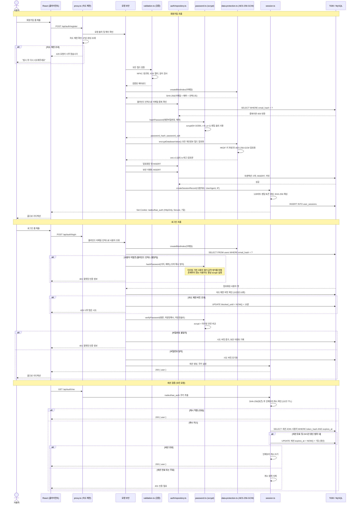

---

## 6. 날씨 점수 파이프라인 — 액티비티 다이어그램

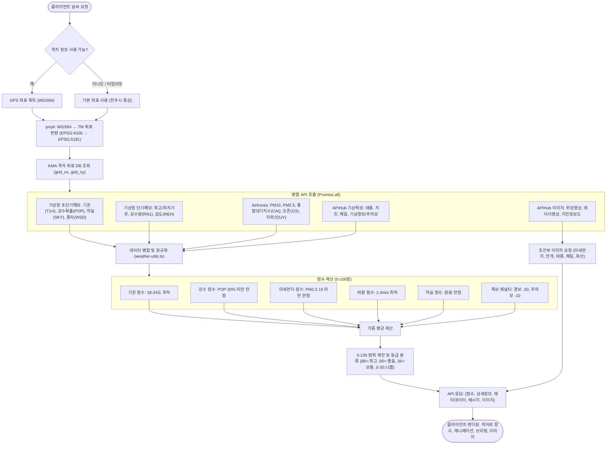

---

## 7. AI 채팅 흐름 — 시퀀스 다이어그램 (대시보드 & 랩)

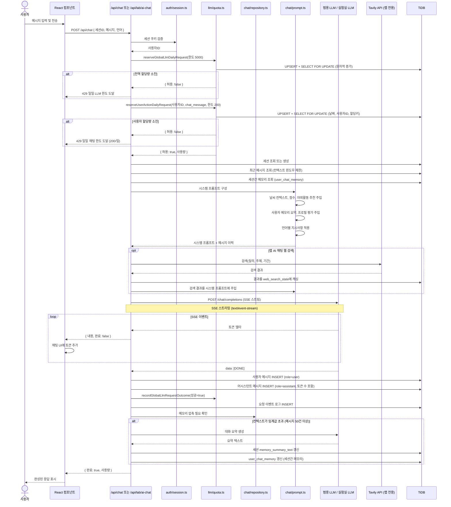

---

## 8. 코드 공유 협업 — 시퀀스 & 상태 다이어그램

### 8.1 협업 시퀀스

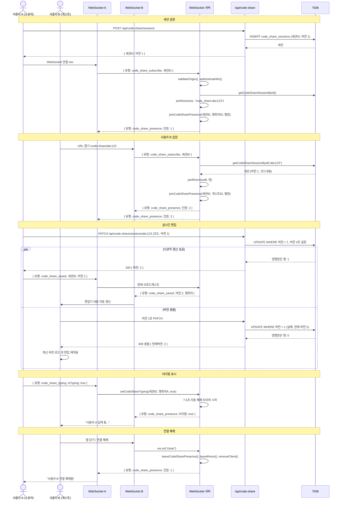

### 8.2 WebSocket 연결 생명주기 — 상태 머신

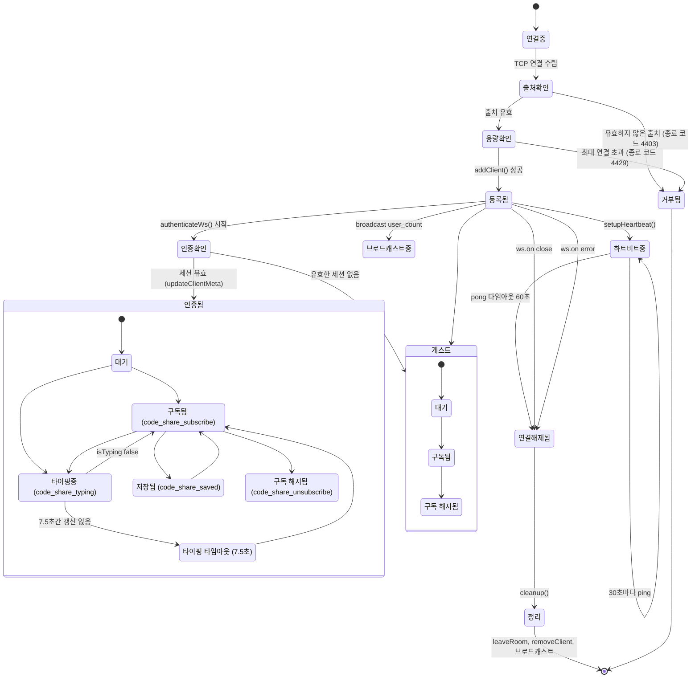

---

## 9. FSRS 간격 반복 학습 — 카드 상태 머신

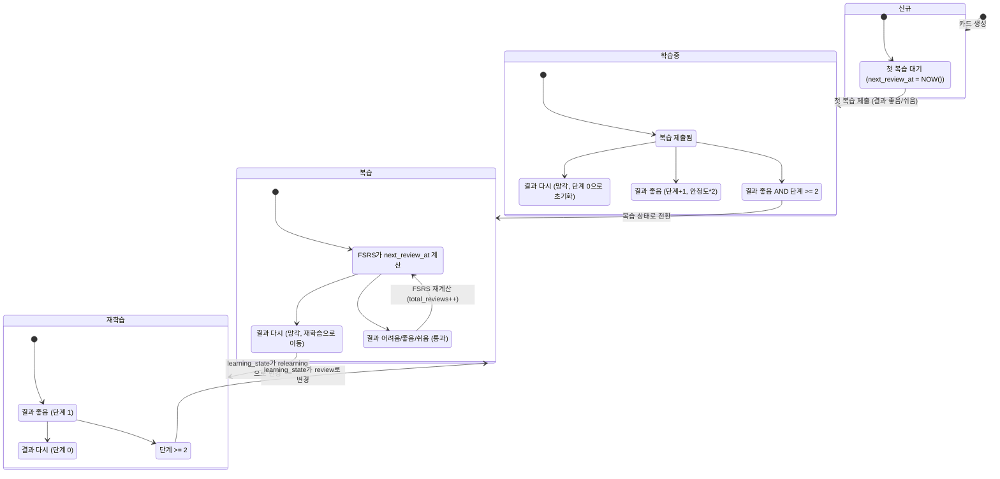

---

## 10. 모듈 의존성 그래프

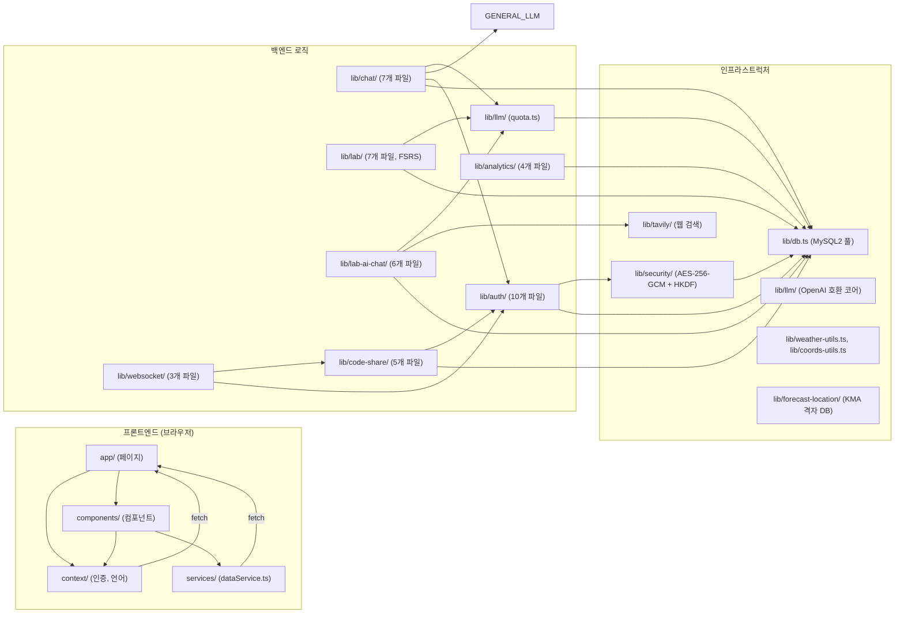

---

## 11. API 라우트 맵 — 전체 엔드포인트

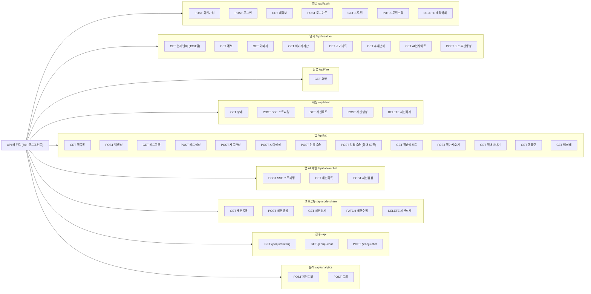

---

## 12. 속도 제한 및 할당량 아키텍처

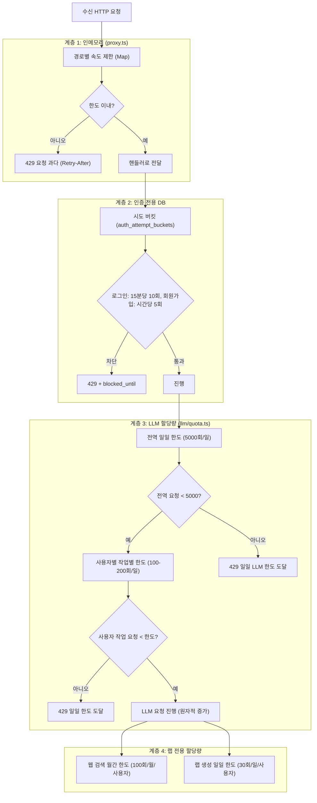

---

## 13. 데이터 암호화 아키텍처

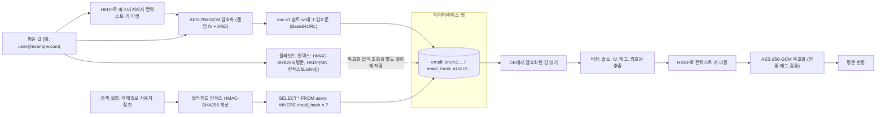

---

## 14. 배포 아키텍처 (운영 환경)

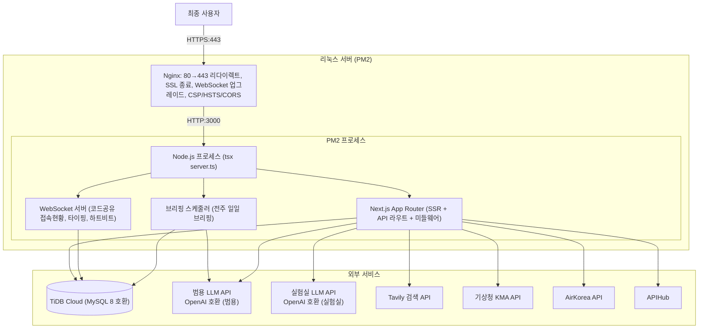

---

## 15. 다국어 지원 아키텍처

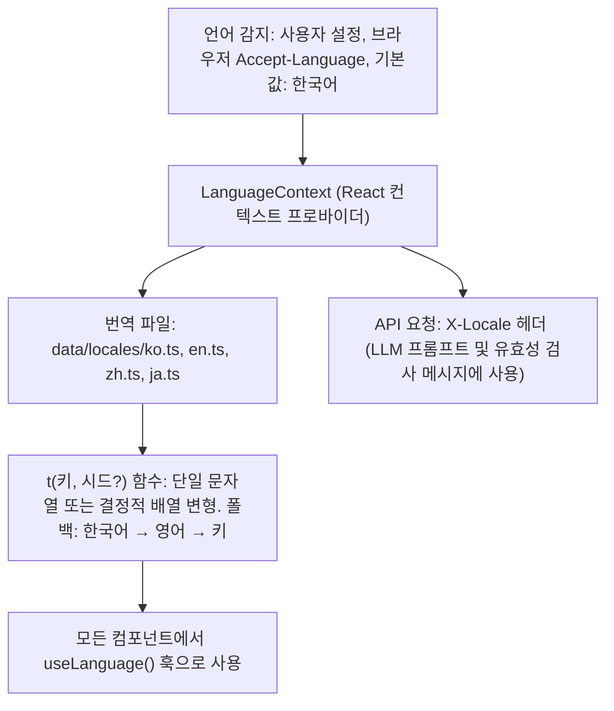

---

## 16. 성능 최적화 — 기기 등급 감지

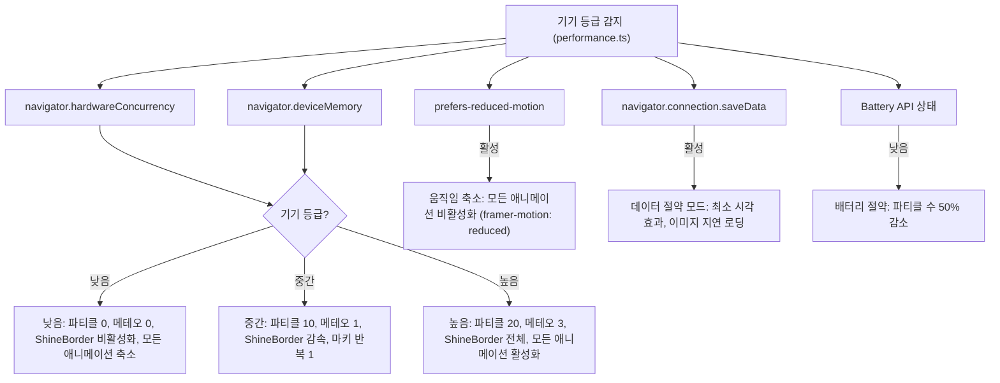

---

## 17. 전주 브리핑 스케줄러 — 타이머 기반 생성

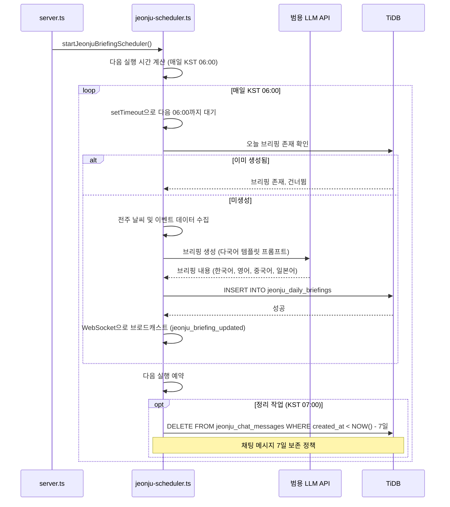

---

## 요약

| 계층 | 핵심 기술 | 담당 모듈 |
|------|-----------|-----------|
| **프론트엔드** | React 19, Next.js 16 App Router, TailwindCSS 4, Framer Motion, CodeMirror 6 | `src/app/`, `src/components/`, `src/context/` |
| **보안** | AES-256-GCM (필드 단위 암호화), scrypt(N=16384) + 페퍼, HKDF, HMAC 블라인드 인덱스 | `src/lib/security/`, `src/lib/auth/` |
| **인증** | 쿠키 기반 세션 (7일 TTL), SHA-256 토큰 해시, 인메모리 LRU 캐시 | `src/lib/auth/session.ts`, `src/lib/auth/repository.ts` |
| **데이터베이스** | TiDB / MySQL 8, mysql2/promise, 20개 테이블 | `src/lib/db.ts`, 각 도메인 `schema.ts` |
| **AI** | OpenAI 호환 LLM (범용 + 실험실), SSE 스트리밍, 날씨 컨텍스트 프롬프트 주입 | `src/lib/llm/`, `src/lib/chat/`, `src/lib/lab-ai-chat/` |
| **속도 제한** | 3계층: 인메모리 (proxy.ts) → DB 시도 버킷 → LLM 할당량 (FOR UPDATE) | `src/proxy.ts`, `src/lib/llm/quota.ts`, `src/lib/auth/repository.ts` |
| **WebSocket** | ws 라이브러리, 방 기반 Pub/Sub, 접속현황 추적, 하트비트, 타이핑 표시 | `src/lib/websocket/` |
| **간격 반복 학습** | FSRS v5 알고리즘 (안정도, 난이도, 상태 머신) | `src/lib/lab/` |
| **검색** | Tavily API, 결과 캐싱, 월간 할당량 | `src/lib/tavily/`, `src/lib/lab-ai-chat/` |
| **다국어** | 4개 언어 (한국어/영어/중국어/일본어), 결정적 배열 변형 선택 | `src/context/LanguageContext.tsx`, `src/data/locales/` |
| **분석** | 개인정보보호 우선, 동의 기반, 다차원 메트릭 | `src/lib/analytics/` |
| **배포** | PM2 + Nginx, 단일 Node.js 프로세스 (HTTP + WS), TiDB Cloud | `server.ts`, Nginx 설정 |
